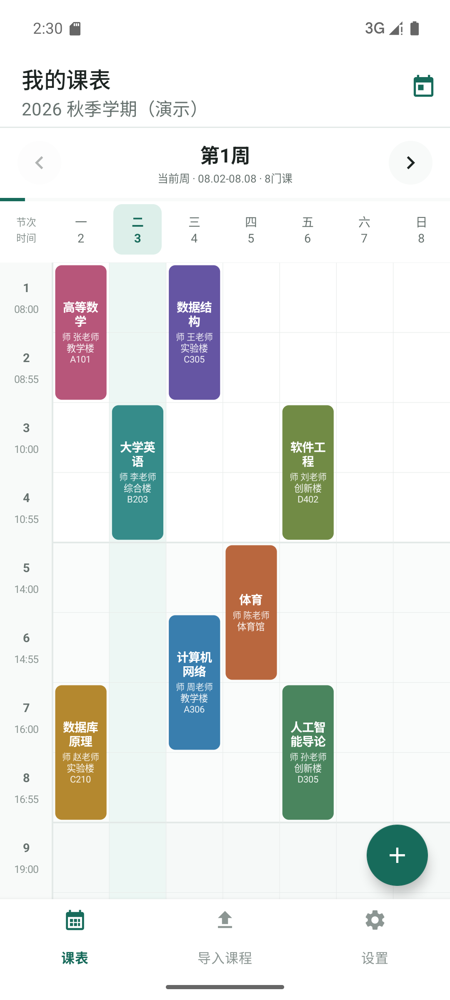

# CourseSchedule 课程表

[](https://developer.android.com/)
[](https://kotlinlang.org/)
[](LICENSE)
[](https://github.com/cakeni/CourseSchedule/actions/workflows/android-ci.yml)

一款专注于日常查看、导入和管理课程的 Android 应用。课程数据保存在本机，不依赖账号或自建服务器。

<p align="center">
  
</p>

## 功能

- 左右跟手切换周次，每周保留独立的纵向滚动位置。
- 周视图展示课程名称、教师和完整地点，支持隐藏周末与调整课程块高度。
- 点击课表空白处可按对应星期和节次快速添加课程；也支持编辑、删除、单双周、课程颜色、备注和冲突检测。
- 导入 `.xlsx`、JSON、CSV、HTML 和纯文本，导入前检查无效项、重复项与时间冲突。
- 可在应用内登录教务网页，按需切换电脑模式或横屏模式；本地解析失败时，可选择使用自己的 DeepSeek 或 OpenAI API Key 识别当前课表页。
- 支持导入覆盖后的撤销，以及包含学期和显示设置的 JSON 完整备份。
- 管理学期起始日期、总周数和当前学期。
- 自定义每节课开始时间，并通过系统通知设置课前提醒。

## 环境要求

- Android 8.0（API 26）或更高版本
- JDK 17
- Android SDK 34
- Android Studio 或命令行 Gradle

## 构建

克隆仓库后，在 Android Studio 中打开项目根目录并等待 Gradle 同步：

```bash
git clone https://github.com/cakeni/CourseSchedule.git
cd CourseSchedule
```

也可以使用命令行完成检查和构建：

```bash
# macOS / Linux
./gradlew lintDebug testDebugUnitTest assembleDebug
```

```powershell
# Windows PowerShell
.\gradlew.bat lintDebug testDebugUnitTest assembleDebug
```

调试 APK 输出到：

```text
app/build/outputs/apk/debug/app-debug.apk
```

`local.properties` 只保存本机 Android SDK 路径，不应提交到版本库。首次使用 Android Studio 打开项目时会自动生成。

## 导入课程

应用支持结构化课程表和常见的周课表网格。推荐的字段包括：

```text
课程名称,教师,教室,星期,开始节次,结束节次,开始周,结束周,单双周
```

导入前会显示课程数量、冲突、重复、无效数据，以及地点和教师字段的完整度。

- 教务目录收录 3,566 条本科、研究生和通用教务候选入口配置；其中 2,682 条可直接打开，另有 764 条已有本地解析路线、可填写学校官网确认的教务网址后试用，剩余 120 条仍需专用适配或可靠入口。“收录”不等于逐校适配或真机验证，目前只有西南石油大学经过用户真机验证。
- 目录会区分“已验证 / 通用适配 / 实验识别 / 需专用适配”。应用不接入 `ziyan` 云端解析；其中 984 条经入口复核后改走设备上的实验性通用解析，剩余 104 条只显示说明与反馈入口，不要求用户手填网址。
- 可尝试的入口会按教务类型走通用解析，并在导入预览中核对；解析不到明确的课程、星期、节次或周次时会中止，不会猜测导入。旧学校仅有 HTTP 时必须先确认明文风险。
- AI 识别是可选兜底：只在本地解析失败且用户主动选择后使用。应用只提取可信课表页中可见、具有课表特征的表格文字，不发送 Cookie、密码、表单值、URL、脚本或完整 HTML；API Key 不保存，识别结果仍须经过校验和导入预览。
- 旧版 `.xls` 暂不支持，请先在 Excel 中另存为 `.xlsx`。
- 应用只能导入源文件中实际存在的信息。若学校导出的文件没有教师姓名，导入预览会显示教师完整度为 `0/N`，可在课程详情中手动补充。

更完整的格式示例见 [导入说明](docs/IMPORTING.md)。

## 技术结构

- Kotlin + Android View System
- MVVM、ViewModel、LiveData 与 Coroutines
- Room 本地数据库
- Material Components
- ViewPager2 周分页与自定义 `CourseTableView`
- 基于 SAX/ZIP 的轻量 `.xlsx` 解析，不需要存储权限

```text
app/src/main/java/com/courseschedule/
|-- data/          Room 实体、DAO、仓库和备份模型
|-- domain/        排课规则与提醒时间计算
|-- ui/            主界面、课程编辑、导入和设置
|-- utils/         偏好设置、提醒与开机恢复
|-- view/          自定义课程表视图
`-- viewmodel/     页面状态与数据协调
```

## 隐私与权限

应用只在用户主动导入时访问学校网站，或在用户明确选择 AI 兜底时访问所选 AI 服务商；没有统计或广告 SDK。课程数据存储在本机 Room 数据库中；Android 系统备份可能按设备设置备份应用数据。权限用途和数据边界见 [隐私说明](docs/PRIVACY.md)。

## 参与贡献

提交问题前请先搜索现有 Issue。代码贡献流程、分支命名和检查命令见 [CONTRIBUTING.md](CONTRIBUTING.md)。参与本项目即表示同意遵守 [行为准则](CODE_OF_CONDUCT.md)。

## 许可证

本项目使用 [MIT License](LICENSE)。
