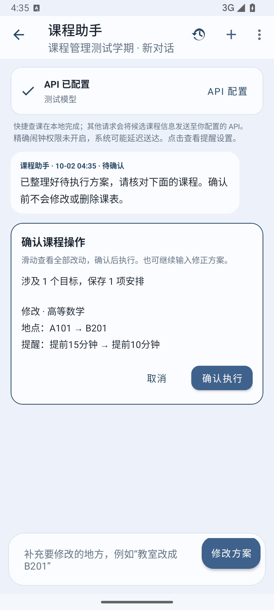
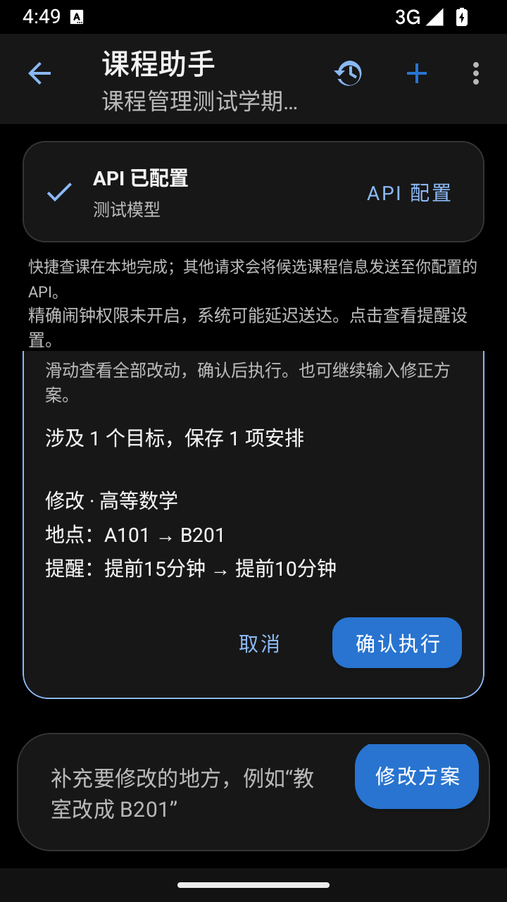
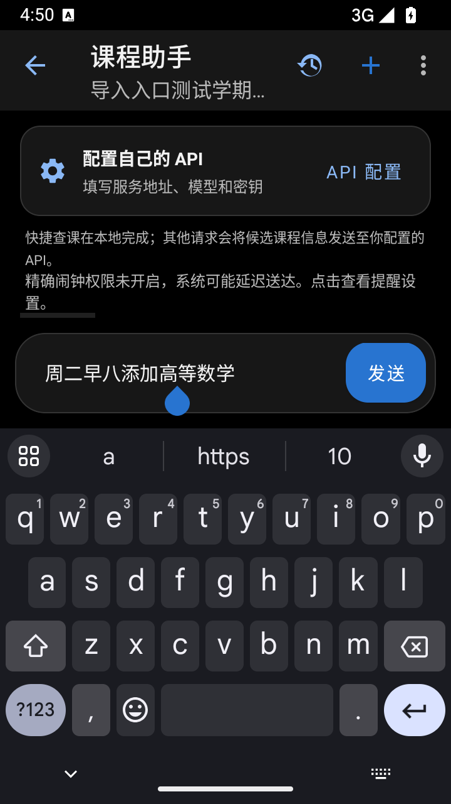

# 课程助手优化与验证

日期：2026-10-02。基线：`main` 的 `413f476c379e4917b180171f2be4aecc826d044c`（1.0.18）。分支：`feat/course-assistant-reliability`，版本：1.0.19 / versionCode 20。原工作目录保持原状，源码修改在独立工作树中完成。

## 审查项落实

| 审查项 | 实现与覆盖 |
| --- | --- |
| 1. 原有冲突阻断修改与撤销 | 比较新旧冲突关系，保留原有交集但不扩大；撤销保存原冲突邻居快照。单元测试与真实数据库测试覆盖备注/提醒修改、删除撤销、同时修改冲突课程，以及后续新增冲突时禁用撤销。 |
| 2. 错误字段被静默忽略 | 增加 version/action 协议，拒绝未知字段、错误类型、不一致动作与混合查询/更改；可选 JSON 模式；成功回执由本机生成。旧版合法 JSON 仍可读取。 |
| 3. 学期外周次错误 | 按本地日历计算日期和周次，发送真实学期阶段；学期外实际周次为空，不夹取首周或末周。 |
| 4. 提醒可用性反馈 | 显示总开关、通知权限与精确闹钟状态，点击进入设置，返回时刷新；保存课程提前量不会自行启用总开关。 |
| 5. 本地查询与请求预算 | 模型提取查询条件，本地筛选完整本学期课表并报告空结果；快捷查课无须 API；上下文最多200条候选，按文本预算截取并说明数量；整个请求上限64,000字符，历史上限12,000字符，不发送正常课表的完整备注。 |
| 6. 单次上课与课程关联 | occurrences 支持指定周次/原日期取消、移动或修改一次课；本地拆分周次并保留时长与其他字段；同源安排提供 groupIds，批量范围须明确。 |
| 7. 修正待确认方案 | 待确认时继续输入修正，仍须确认；失败/停止保持原方案，支持重试；预览突出变化字段并显示目标与最终安排数。批量新增也先确认。 |
| 8. 长会话与进度 | RecyclerView 复用消息，稳定 ID、按消息 ID 向前分页，保留阅读锚点；显示准备/连接/等待/校验/保存阶段；响应体大小与读取时间受限。 |
| 9. 批量与撤销状态 | 最多20个逻辑目标、80条最终安排；重开或返回页面时检查撤销目标、学期和新冲突，并解释不可用原因。 |
| 10. 语义评测与 CI | 增加虚构课程语义评测脚本；新增 CI 模拟器流程，覆盖会话、管理、失败重试、停止、原冲突及两阶段进程重启。 |

数据库保持版本3，无新增依赖。旧撤销快照没有原冲突基线时继续保守拒绝冲突恢复；新操作保存完整基线。范围为 Android 课程助手。

## 本地验证

`gradlew.bat testDebugUnitTest lintDebug assembleDebug assembleDebugAndroidTest assembleRelease` 通过：162个单元测试（其中助手21个），0失败；lint 0错误、131警告；Debug 与经过 R8 的 Release 构建通过。

Android 15 / API35 模拟器通过13个助手流程测试，以及强制关闭前准备、关闭后恢复各1个测试。还检查了360×640dp小屏、深色模式、键盘布局和确认按钮的完整可见性。

本机 `connectedDebugAndroidTest` 的 UTP 在测试启动前发生空指针异常（报告0个测试）。使用同一测试 APK 的 AndroidJUnitRunner 直接运行，并检查日志必须包含 `OK (N tests)`；CI 采用相同入口。CI 的远端执行结果以 PR 检查为准。

```powershell
.\gradlew.bat testDebugUnitTest lintDebug assembleDebug assembleRelease
.\analysis\assistant-improvements-20261002\run-android-flows.ps1 -AdbPath '你的SDK/platform-tools/adb.exe' -Serial '你的模拟器编号'
```

## 真实模型评测

使用用户授权的现有 DeepSeek 配置，服务端返回可用模型 `deepseek-flash`。只发送虚构课程和对话，未连接真实课程数据库；密钥仅在进程内读取并用于认证，没有写入源码、报告或 APK。评测启用服务商支持的 JSON 模式，单次输出限制2048 tokens。

21个场景涵盖同名追问、缺课名、默认时长、明确目标修改/删除、单周取消/调课、指定周与教师查询、备注追加、提醒、跨学期、节次无法匹配、可/不可撤销、方案修正、学期外和旧操作不重放。判定检查动作、目标、字段、周次及未提及元数据的保留；查询结果由生产查询规则核对。

首轮19/21，两项响应被生产解析器拒绝。补充无操作协议示例后，第二轮20/21，唯一未完成项为连接中断；该项单独重试通过。最终21项语义计划通过，被接受的未授权更改方案为0。成功调用延迟中位数1,370ms，P95为2,671ms；有效响应合计51,437 tokens。该统计不含首轮与失败连接的消耗，也不是一般化准确率保证。固定样例尚未覆盖所有口语、服务商和批量极限的模型理解，批量边界另有本地单元测试。

结果：[最终记录](live-results.json)、[首轮记录](live-initial-results.json)、[单项重试](live-retry-results.json)。最终记录保留连接失败的前次尝试。可离线重新验证已记录计划，也可显式传入已有密钥文件路径运行新的联网评测：

```powershell
.\analysis\assistant-improvements-20261002\run-live-eval.ps1 -VerifyReport
.\analysis\assistant-improvements-20261002\run-live-eval.ps1 -CredentialFile '本机已有密钥文件的完整路径' -Model 'deepseek-flash'
```

JSON 模式依据 [DeepSeek 官方文档](https://api-docs.deepseek.com/guides/json_mode/)。模型语义通过并不替代本地校验，修改/删除仍须用户确认；网络中断可在应用内显式重试。

## 界面证据

以下为模拟器中的虚构课程，浅色为常见手机尺寸，深色为360×640dp小屏。卡片内容与历史均可滚动，确认按钮与输入栏分别位于可操作区域。

<p>
  
  
  
</p>
