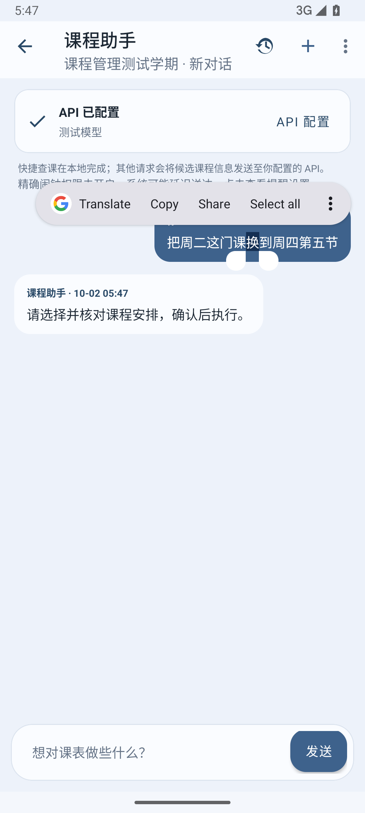
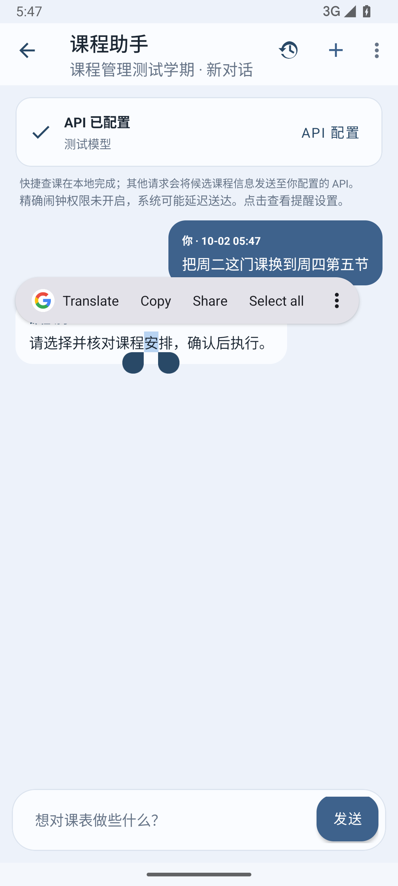
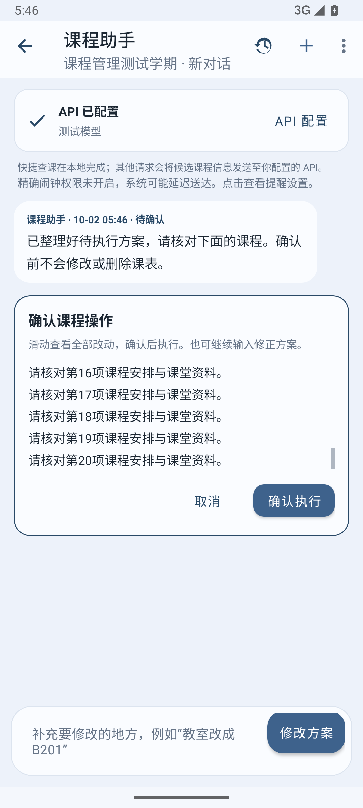
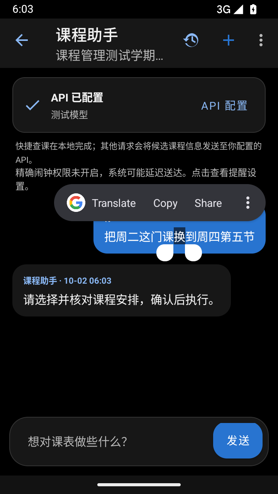
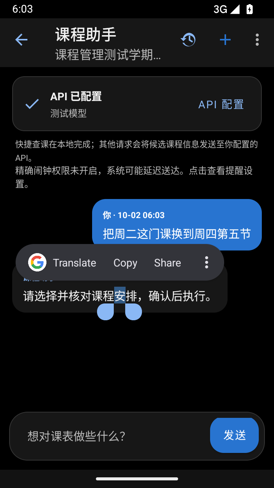
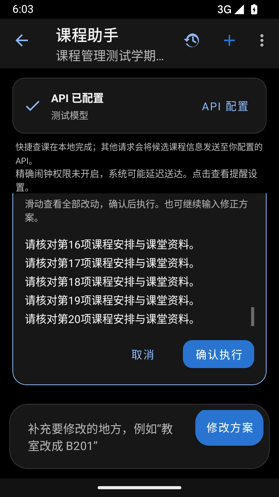

# 确认方案滚动与文字选择修复

2026-10-02。修复前，真实触摸测试能复现两个问题：在确认方案中向上拖动后内容的滚动位置仍为0；长按用户消息后，选中区域与蓝色气泡无法区分。

确认预览现在独立处理纵向滑动，阻止会话列表抢走手势，并在开始选择文字之前允许预览拦截滑动。已有选区仍使用原生选择与复制。修正方案时，预览回到顶部重新核对。

用户消息和助手消息分别使用适合气泡背景的选择高亮与选择手柄，浅色、深色模式各有对应配色。

## 验证

- 修复前的两个核心回归断言均失败，修复后通过。
- Android15/API35：15个助手流程测试通过，包括新增的两项交互回归。
- 360×640dp深色模式：两项交互回归再次通过。
- 真实向上滑动至长方案最后一行，会话列表位置不变，确认按钮坐标不变，确认与取消按钮完整可见。
- 长按能选择消息与方案文字；原生复制结果与选区内容一致；选区背景与气泡的对比度至少1.4:1，选中文字对比度至少4.5:1。
- 修正方案后预览回到顶部；预览、滚动、复制及取消均未修改课程记录。
- 162个单元测试通过，lint无错误（仍有131项既有警告），Debug、测试APK与Release构建成功。

构建命令：`gradlew.bat testDebugUnitTest lintDebug assembleDebug assembleDebugAndroidTest assembleRelease`。

设备回归入口：`CourseAssistantManagementTest#pendingPreviewSwipesIndependentlyAndKeepsConfirmationButtonsVisible` 与 `CourseAssistantManagementTest#selectedMessageRangeIsVisibleAndReadableForBothSpeakers`；可通过已有的 `analysis/assistant-improvements-20261002/run-android-flows.ps1` 执行全部助手流程。

安装包 SHA-256：`4c163e7a4f3035e04c6379a1cb1abf826e2bf1684a9975e95b07b1864af39668`。

## 截图

  
  
  

  
  
  

