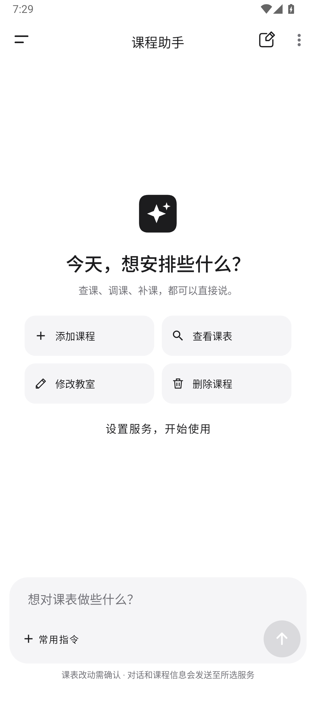
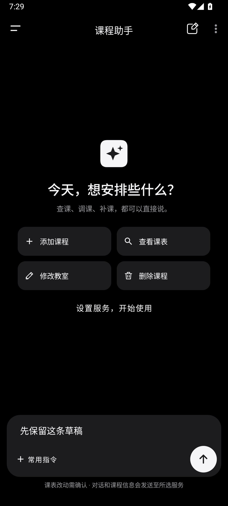
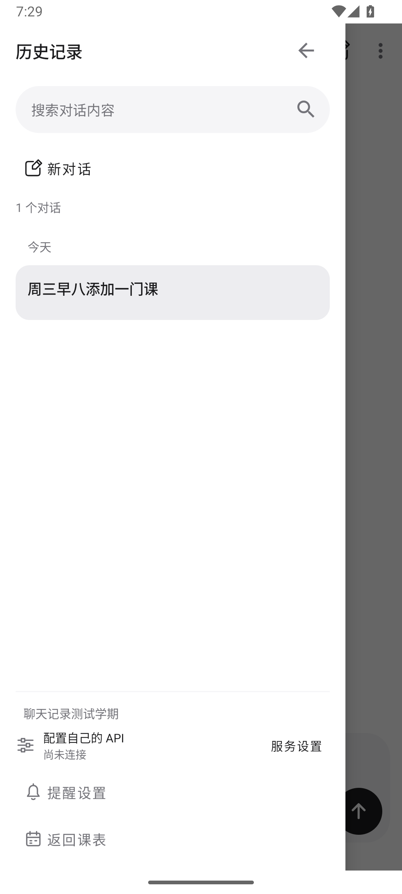
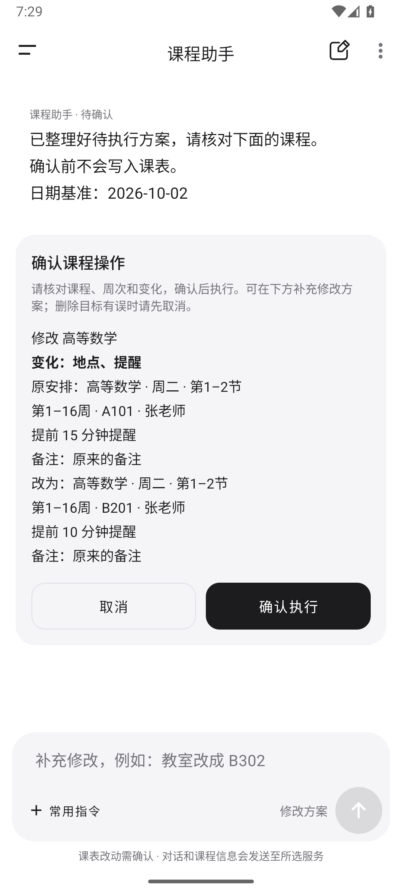

# 课程助手

在“导入课程”页选择“AI 对话导入”，或从课表页菜单打开“课程助手”。填写服务商提供的 HTTPS API 地址、支持 Chat Completions 的模型名称和 API Key。地址支持基础路径或完整的 `/chat/completions` 地址；密钥默认仅在当前页面使用，也可选择在本机加密保存并随时清除。

## 示例

```text
帮我添加高等数学：周三第 1–2 节，第 1–16 周，每周上课，教室 A101。
周三有哪些课？
把周三的高等数学教室改成 B201，提前 15 分钟提醒。
只把下周三的高等数学移到周五第 3–4 节，其他周不变。
仅取消第 5 周的高等数学。
下周四哪些节次空闲？
删除周三的高等数学。
撤销刚才的操作。
```

支持按实际节次或具体钟点描述课程。信息不足、目标不明确时会追问；重复、新引入的时间冲突或课程已在其他页面修改时整批拒绝。新增、修改和删除均须先核对具体方案并点击确认。实际执行结果与课程修改在同一个数据库事务中保存，撤销会检查后续更改。原有冲突可以在修改备注、地点或提醒时保留；撤销允许恢复操作前的冲突，但会阻止与后来新增安排的冲突。

日期、相对周次、查询筛选与空闲节次由本地计算；学期外的“本周、下周”会提示重新指定日期。单次调课、取消、修改和补课会保留其他周。确认卡片突出变化字段，可继续输入“教室改成 B302”等补充修正；补充只修改原方案，不会执行，最终仍须点击确认。删除目标有误时请先取消。

查询结果包含明确的查询范围、课程编号与空结果。初始写入方案在展示确认前就检查重复、冲突和过期目标，最终执行时再次校验；冲突提示列出实际重叠的周次和节次。同名课程无法确定目标时提供候选选择，选择后重新整理方案并核对确认；后续“这门课”可绑定所选课程，模型不能改成其他目标。批量操作存在目标歧义时需拆开明确目标。

失败或中断后的重试保留原请求日期，跨天和跨周不会重新解释“今天、明天、下周”；查询回执显示日期基准与解析范围。旧记录没有保存原日期时，不直接重发，会恢复原文字到输入框并提示核对日期。候选选择也在本地保存，重启可恢复；原课程或学期已变化时取消过期候选。

提醒回执会说明总开关、通知渠道或精确提醒不可用的状态，左侧会话栏底部提供提醒设置入口。

新的查课结果提供“查看课程详情”入口，多条结果可选择一门进入已有课程编辑页，返回后继续原对话。入口使用本地查询保存的课程 ID，打开时读取最新课程；已删除、移到其他学期或学期已切换的结果会要求重新查询。早期纯文字查询记录仍可阅读，重新查询后可使用该入口。

时间冲突会提供最多三个同日备选节次，保留该安排的周次和课时长，并检查同批其他安排。备选只按个人课表计算，需要明确选择节次后重新描述并确认；没有可用方案时会说明，提示调整星期或其他冲突课程。

## 聊天记录

助手页面采用独立的黑白灰外观：浅色为白底和浅灰分组，深色为黑底和灰色分组。标题、聊天气泡、确认卡片和常用指令使用一致的字号、圆角与图标。其他页面沿用原有主题。

左上角打开会话栏，按今天、昨天、近 7 天和更早分组切换本学期对话。右上角和会话栏均可新建对话，右上角更多菜单可删除当前对话。服务配置、提醒设置和返回课表位于会话栏底部；撤销入口位于执行回执之后。聊天、草稿、待确认方案和本对话最近一次成功操作的撤销记录在本地保留，重启后可恢复。长对话可加载更早消息。删除聊天不会删除课程；删除学期会删除对应聊天。

会话栏顶部支持本学期标题和消息内容的关键词搜索，在本机查找，不调用模型服务。结果显示匹配内容和时间，点击消息结果可定位并突出关键词，同时加载附近上下文；可继续加载更早消息或“回到最新消息”。标题匹配结果打开该对话最新消息。一次最多显示 50 条匹配结果，超出时提示缩小关键词范围；清空搜索恢复会话列表。打开搜索结果不会执行课程方案，草稿和待确认状态继续保留。

输入区提供常用指令，点击只填入草稿，不自动发送。空白草稿不能发送；请求进行中，发送按钮变为停止按钮。失败后可以显式重试。键盘弹出时收起空白页欢迎区和会话栏设置区，为输入和搜索结果留出空间。返回键先关闭会话栏，再返回之前页面。重启后不会自动重发请求或执行待确认方案，失效方案会取消。早期版本未保存的聊天无法补回。

每次发送会将近期对话与当前学期课程信息直接提交给所配置的 API，完整数据范围见 [隐私说明](PRIVACY.md)。课程 JSON 备份不包含聊天，Android 系统备份可能包含本地数据库与偏好设置；加密保存的密钥不参与系统备份或迁移。

## 升级兼容

1.0.18 使用数据库版本 3，支持原数据库版本 1、主分支的版本 2，以及已分发的课程助手版本 2。升级会保留学期、课程、聊天及操作状态，不清空数据库。主分支版本 2 中用户自行修改的课程颜色不会再次归一化；早期课程助手版本 2 补齐尚未执行的导入课程颜色迁移。

## 流程验证

```powershell
.\gradlew.bat testDebugUnitTest lintDebug assembleDebug assembleDebugAndroidTest assembleRelease
```

模拟器测试覆盖数据库升级、首次启动、加课/查询/修改/删除/撤销、历史切换、草稿、重试、停止、分页、冲突及过期方案。重启测试必须分两阶段执行，在两阶段之间强制停止应用；也可在此期间覆盖安装新版 APK 验证真实升级：

```text
adb shell am instrument -w -r -e class com.courseschedule.ui.assistant.AssistantProcessRestartTest#prepareBeforeProcessKill com.courseschedule.test/androidx.test.runner.AndroidJUnitRunner
adb shell am force-stop com.courseschedule
adb shell am instrument -w -r -e class com.courseschedule.ui.assistant.AssistantProcessRestartTest#verifyAfterProcessKill com.courseschedule.test/androidx.test.runner.AndroidJUnitRunner
```

这些测试使用虚构课程与本地模拟响应，无须真实 API Key。

<p>
  
  
  
  
</p>

截图来自模拟器，课程信息为虚构示例。
