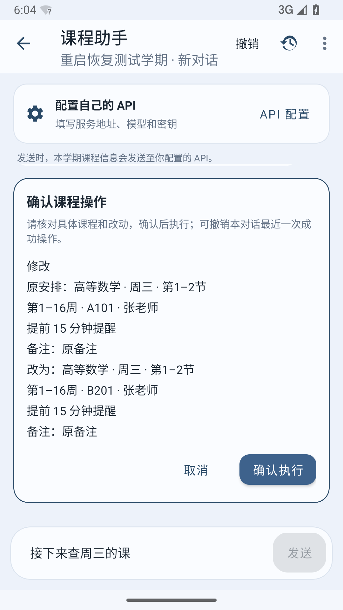
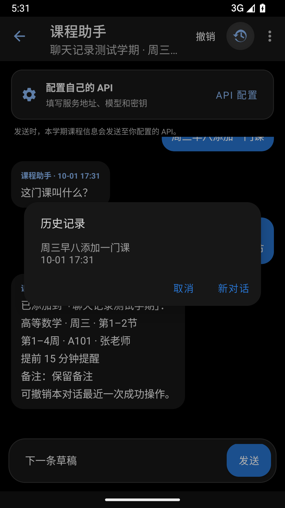

# 课程助手

在“导入课程”页选择“AI 对话导入”，或从课表页菜单打开“课程助手”。默认使用 DeepSeek，地址为 `https://api.deepseek.com`、模型为 `deepseek-flash`，并开启 JSON 格式约束；填写自己的 DeepSeek API Key 即可使用。也可改为其他兼容 Chat Completions 的服务商。地址支持基础路径或完整的 `/chat/completions` 地址；密钥默认仅在当前页面使用，也可选择在本机加密保存并随时清除。

## 示例

```text
帮我添加高等数学：周三第 1–2 节，第 1–16 周，每周上课，教室 A101。
周三有哪些课？
把周三的高等数学教室改成 B201，提前 15 分钟提醒。
删除周三的高等数学。
撤销刚才的操作。
```

支持按实际节次或具体钟点描述课程。信息不足、目标不明确时会追问；重复、新引入的时间冲突或课程已在其他页面修改时整批拒绝。单条新增通过本地校验后保存，批量新增、修改和删除须先确认具体方案。实际执行结果与课程修改在同一个数据库事务中保存，撤销会检查后续更改。

1.0.19 支持“只取消第5周的课”“只把下周这一次移到周五第3节”等临时安排，其他周次、教师、备注和提醒会保留；只有明确要求整学期时才删除整条课程。批量新增也会先显示方案，一次最多20个课程目标、展开后最多80项安排。已有冲突不阻止备注、地点或提醒的修改，但不能扩大冲突；删除后撤销可以恢复原有冲突安排。

待确认时可继续输入“地点改成B201”等补充，助手会重新整理方案并再次等待确认，失败时保留原方案。卡片突出改变的字段。若撤销因后续更改而失效，页面会显示原因；提醒总开关或通知权限关闭时也会说明，并可点击进入设置。

“今天有哪些课”“明天有哪些课”“本周有哪些课”“下周有哪些课”和“周三有哪些课”可在本地查询，无须配置 API。“周三”的快捷查询以当前查看周为准；“本周、下周”以实际日期为准。其他自然语言查询会由模型提取条件、本地筛选完整课表，空结果也由本地确认。开学前与学期结束后不会把本周套用首周或末周。

API 配置里可按服务商能力开启 JSON 格式约束。不支持此选项的服务可关闭，操作结果始终经过本地字段、目标与范围校验。请求会显示连接、等待、校验及保存阶段。

真实模型评测使用虚构课表，脚本与结果见 [优化验证记录](../analysis/assistant-improvements-20261002/README.md)。运行脚本时传入已有密钥文件路径；密钥不写入报告或构建包。

## 聊天记录

右上角历史记录可切换本学期的对话，也可新建或删除对话。聊天、草稿、待确认方案和本对话最近一次成功操作的撤销记录在本地保留，重启后可恢复。长对话可加载更早消息。删除聊天不会删除课程；删除学期会删除对应聊天。

请求失败可以重试，正在生成时可以停止。重启后不会自动重发请求或执行待确认方案，失效方案会取消。早期版本未保存的聊天无法补回。

通过 API 发送时会提交近期对话、当前学期信息和必要的候选课程信息；快捷本地查询不会联网。正常课程上下文不再发送完整备注，聊天中由用户提供的备注和待修改方案的必要内容仍可能提交给模型。完整数据范围见 [隐私说明](PRIVACY.md)。课程 JSON 备份不包含聊天，Android 系统备份可能包含本地数据库与偏好设置；加密保存的密钥不参与系统备份或迁移。

## 升级兼容

1.0.18 及以后的版本使用数据库版本 3，支持原数据库版本 1、主分支的版本 2，以及已分发的课程助手版本 2。升级会保留学期、课程、聊天及操作状态，不清空数据库。主分支版本 2 中用户自行修改的课程颜色不会再次归一化；早期课程助手版本 2 补齐尚未执行的导入课程颜色迁移。

## 流程验证

```powershell
.\gradlew.bat testDebugUnitTest lintDebug assembleDebug assembleDebugAndroidTest assembleRelease
```

模拟器测试覆盖数据库升级、首次启动、加课/查询/修改/删除/撤销、历史切换、草稿、重试、停止、分页、冲突及过期方案。重启测试必须分两阶段执行，在两阶段之间强制停止应用；也可在此期间覆盖安装新版 APK 验证真实升级：

```text
adb shell am instrument -w -r -e class com.courseschedule.ui.assistant.AssistantProcessRestartTest#prepareBeforeProcessKill com.courseschedule.test/androidx.test.runner.AndroidJUnitRunner
adb shell am force-stop com.courseschedule
adb shell am instrument -w -r -e class com.courseschedule.ui.assistant.AssistantProcessRestartTest#verifyAfterProcessKill com.courseschedule.test/androidx.test.runner.AndroidJUnitRunner
```

这些测试使用虚构课程与本地模拟响应，无须真实 API Key。

如果本机 Gradle 的 UTP 在启动测试前报错，可用验证脚本运行相同的 AndroidJUnitRunner 测试；新增助手 CI 也采用这个入口，并检查成功结果：

```powershell
.\analysis\assistant-improvements-20261002\run-android-flows.ps1 -AdbPath '你的SDK/platform-tools/adb.exe' -Serial '你的模拟器编号'
```

<p>
  
  
</p>

截图来自模拟器，课程信息为虚构示例。
