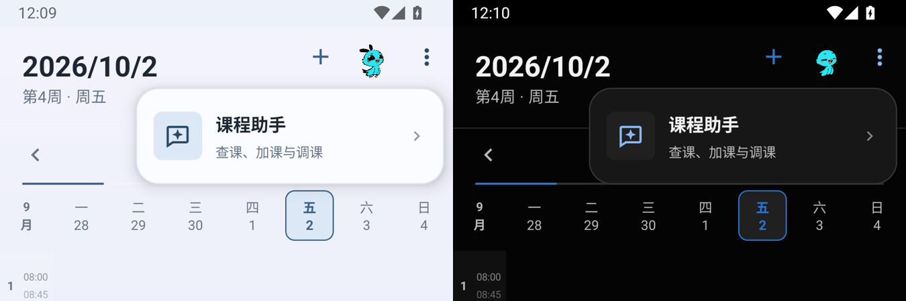

# 课程助手入口与首帧显示

晴课表 1.0.19 将右上角菜单改为带图标、标题、用途说明和箭头的圆角卡片，使用应用的浅色与深色配色，支持整行点击、菜单外关闭和返回键关闭。

已有会话此前会先显示欢迎页，历史记录加载后再切换为聊天。现在等待初始会话、草稿和操作状态恢复完毕后绘制第一帧，并直接定位到最新消息；助手窗口关闭系统启动预览。已有请求在页面重建后继续运行，不会阻止已经恢复的会话显示。

## 验证

- 152 项单元测试通过，Lint 无错误，Debug 与 AndroidTest 构建通过。
- API 35 模拟器浅色、深色各 11 项回归通过，使用虚构数据与本地响应。
- 首帧检查确认已有的 20 条消息与草稿已显示、欢迎页没有出现，且已定位到最新消息。
- 菜单流程检查覆盖打开、返回关闭、再次打开、进入助手与 API 配置；既有待确认状态和页面重建流程通过。
