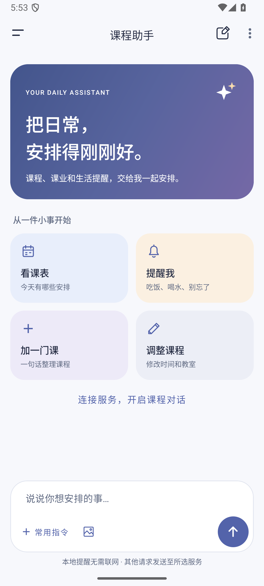
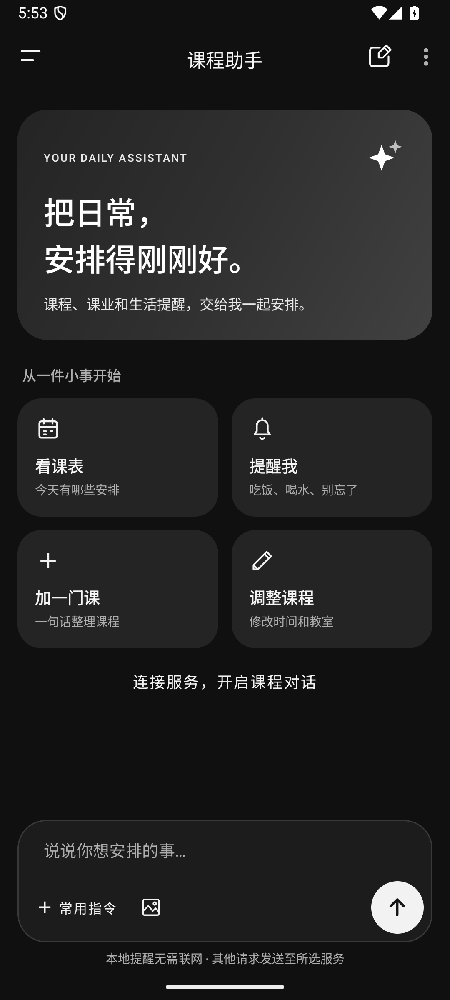
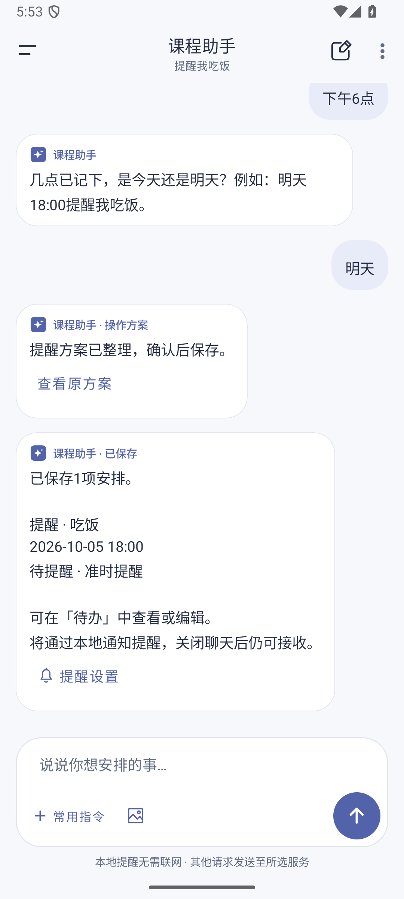
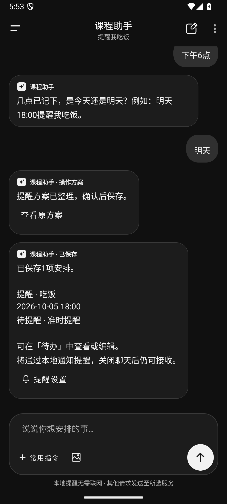

# 助手页面与生活提醒

助手页增加欢迎卡片和查课、生活提醒、加课、调整课程四个快捷入口。浅色模式使用靛蓝、雾紫与暖杏色；深色模式采用黑白灰。消息气泡、输入栏与待确认操作使用不同层次，历史操作方案默认折叠，可展开查看。

| 浅色模式 | 深色模式 |
| --- | --- |
|  |  |
|  |  |

配色与层次参考 [Linear 的界面重设计](https://linear.app/now/how-we-redesigned-the-linear-ui)、[Gemini 的视觉设计](https://design.google/library/gemini-ai-visual-design) 和 [Material 3 的设计研究](https://design.google/library/expressive-material-design-google-research)。实现复用现有原生布局、矢量图和 Material 组件。

## 生活提醒

“明天12:00提醒我吃饭”“半小时后提醒我喝水”等常见单次提醒在本地处理，无需配置对话服务。只说“提醒我吃饭”时，助手会追问时间；后续补充日期或时间会保留已有信息，页面重建后仍可继续。

提醒先显示操作预览，确认后作为现有事项的 `reminder` 类型保存，复用待办编辑器、闹钟通知和重启恢复。过期时间、重复事项和失效目标会拒绝保存。保存结果显示通知与精确闹钟的实际授权状态，并提供提醒设置入口。

当前支持单次生活提醒，沿用当前学期的事项管理范围。重复提醒会说明范围并询问这一次的日期。

## 验证

- `testDebugUnitTest`、`lintDebug`、`assembleDebug` 和 `assembleDebugAndroidTest` 通过；220 项单元测试中 219 项通过，1 项既有外部视觉评估跳过，新增提醒测试 9 项全部通过。Lint 0 错误。
- 14 次设备测试通过，覆盖多轮时间补充与页面重建、保存确认、真实通知投递、黑白深色、小屏幕与 130% 字体，以及课程、图片和事项回归。
- 新提醒流程使用默认动画时长。既有事项回归测试在关闭系统动画后执行，避免完成行动画期间误点尚未启用的新增按钮。
- `git diff --check` 通过。

本次设备流程由 `AssistantReminderRedesignTest` 覆盖；本地解析由 `AssistantLocalReminderTest` 覆盖。

统计结果见 [validation.json](validation.json)。
