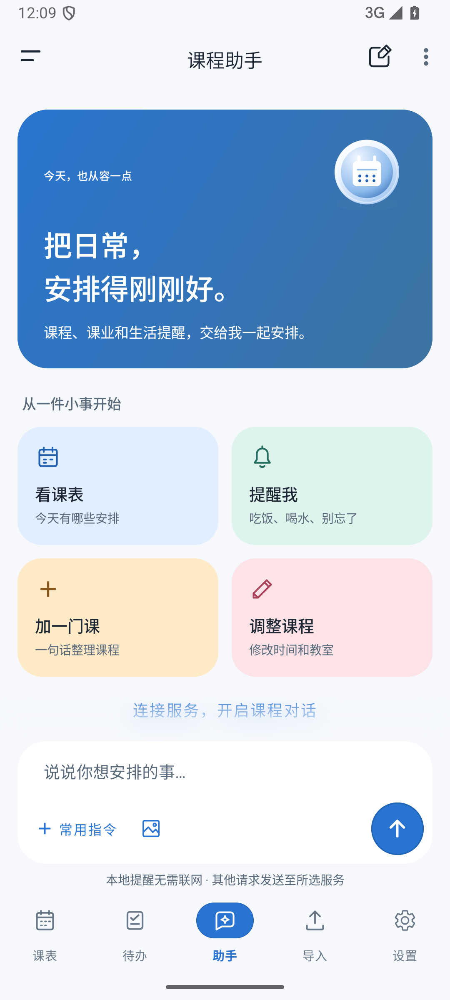
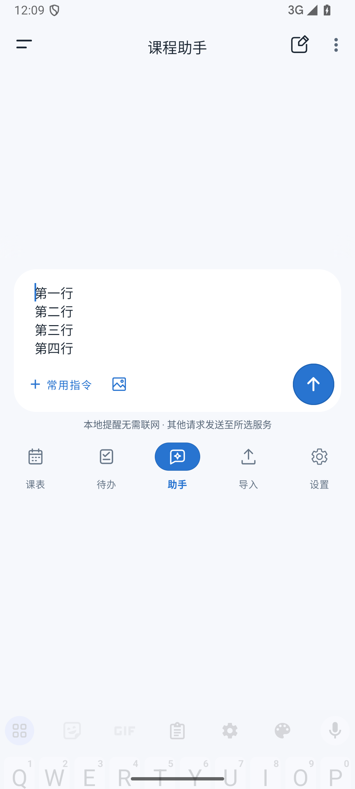
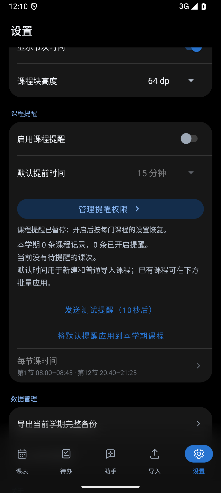
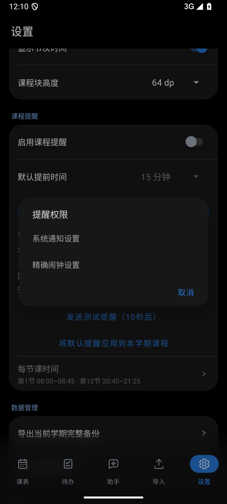

# 助手独立页面与设置交互修复（1.0.68）

课程助手加入底部导航，五个入口依次为课表、待办、助手、导入、设置。助手延续聊天、历史记录和本地提醒功能，切页保留草稿与当前显示周次；输入框和导航在键盘弹出时保持可操作。

设置页在日夜切换前稳定齿轮和胶囊位置，恢复主题时直接定位设置标签。提醒区域新增带箭头的「管理提醒权限」按钮，授权入口在正式版也显示，状态说明作为正文显示。导入页入场总时长缩短约 15%，保留原有顺序和节奏比例。

## 原生截图

截图来自 Android 15 模拟器，助手内容使用合成数据。

| 助手 | 输入键盘 |
| --- | --- |
|  |  |

| 提醒权限入口 | 权限选择 |
| --- | --- |
|  |  |

## 验证

- 同步副本构建：单元测试 254 项通过、1 项跳过，Lint 0 error、285 warning，应用与设备测试 APK 构建成功。
- 发布 APK 的 10 项原生检查通过，覆盖助手切页与草稿保留、键盘避让、五页导航位置、导入入场、连续日夜切换、齿轮反馈、权限按钮和滚动恢复。
- 核对 399 个源文件，与本地已验证版本一致，保留 main 已合并的测试依赖和 CI 配置。
- APK SHA-256：`6e2ce991f780f18485aa4a5ba02d22e040fa214fa6448ec195d5b5ecd1ca60aa`。

详细结果见 [validation.json](validation.json)。
