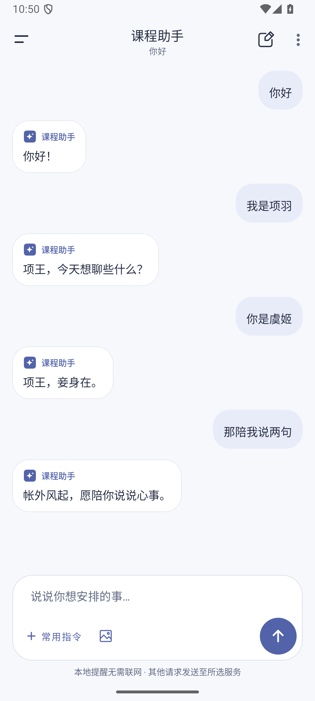
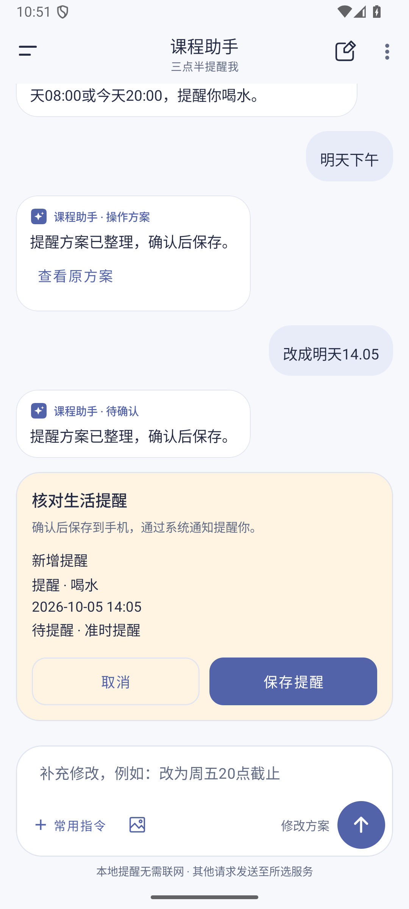
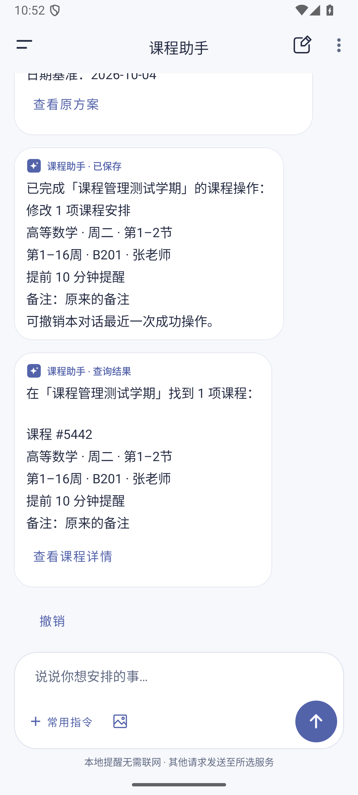

# 课程助手可靠性修复（1.0.42）

旧流程把普通聊天也交给课程操作 JSON 解析器。服务返回正常文字时，会误报“操作格式不完整、课程不存在或超出范围”；`14.05` 和多轮时间补充也可能丢失提醒意图。

现在普通文字直接作为聊天记录显示，安排通过明确的函数工具提出。工具参数经过状态权限、目标和日期校验，新增、修改、删除仍需要用户核对方案并确认后，才由本地事务保存。

## 主要变化

- 系统提示词支持普通聊天、学习问题和用户指定的角色语气，只追问缺失的信息；不会自行分配用户身份。
- 提示词、工具定义、服务回复解码、课程领域校验与网络传输分开维护。系统提示词和动态上下文位于 `AssistantAgentContext.kt`。
- 自然文字和完整 JSON 代码示例没有操作权限。只在服务以 HTTP 400/422 明确拒绝工具参数时启用兼容通道；兼容操作仍需明确类型并通过本地校验。
- 回复格式或参数不合法时最多自动整理一次。网络、鉴权、额度和超时失败不会自动反复请求；停止请求会断开连接并拒绝迟到回复。
- 明确的单次生活提醒继续在本地解析，支持 `14.05`、中文时间、缺失事项追问、时间补充及重启恢复。无法确定上午或晚上时先追问。
- 每次失败请求单独记录实际绑定的课程和原日期。重试不会借用后来浏览的课程；无法确定旧请求绑定信息时恢复原文，要求重新明确目标。
- 同名课程候选在闲聊、失败、重试和重启后保留，也可以取消。有待确认方案时允许课程和事项的只读查询，保留原方案。
- 查询结果显示“查询结果”；聊天回复失败与操作未执行分别显示。查询不会被误标为已保存。
- 单日查询优先使用日期偏移，由本地计算星期。日期与星期冲突在回复校验阶段拒绝，避免错误查询进入执行阶段。

## 验证

开发阶段完成了 254 项单元测试（另有 1 项可选在线视觉评测跳过）、57 个真实 DeepSeek 回合或场景，以及 42 项 Android 回归。真实服务评测仅使用虚构数据，没有数据库写入。

同步时从最新 `main` 创建独立工作区，保留主分支已合并的测试依赖，重新执行：

```powershell
.\gradlew.bat --no-daemon testDebugUnitTest lintDebug assembleDebug assembleDebugAndroidTest
```

同步工作区验证结果：254 项单元测试通过，1 项可选在线视觉评测跳过；Lint 0 错误、234 项现有警告；应用和测试 APK 均构建成功。保留主分支的 AndroidX test ext JUnit 1.3.0 后，42 项设备回归全部通过。模拟器的动画设置已恢复。

助手设备回归覆盖 `AssistantConversationTest`、`AssistantImagesStudyTest`、`AssistantReminderRedesignTest`、`CourseAssistantFlowTest` 和 `CourseAssistantManagementTest`。包括确认前不写入、事务回滚、失败重试、候选选择、方案期间查询、图片、通知和会话恢复。

## 设备截图

截图使用合成测试数据。角色聊天使用固定服务回复，验证消息显示与恢复；真实模型对话在上述 57 个回合或场景中另外验证。

| 普通聊天 | 点号时间提醒预览 | 课程查询标记 |
|---|---|---|
|  |  |  |

## 兼容范围

生活提醒目前支持单次提醒，重复提醒尚未实现。历史上下文有长度限制，角色设定和偏好不作为永久记忆。实际通知送达仍取决于设备的通知权限和后台设置。复杂操作继续通过本地预览和确认保护目标与时间。

仓库只包含源码、测试和说明；服务密钥、本机 SDK 配置、构建日志与安装包不提交。
