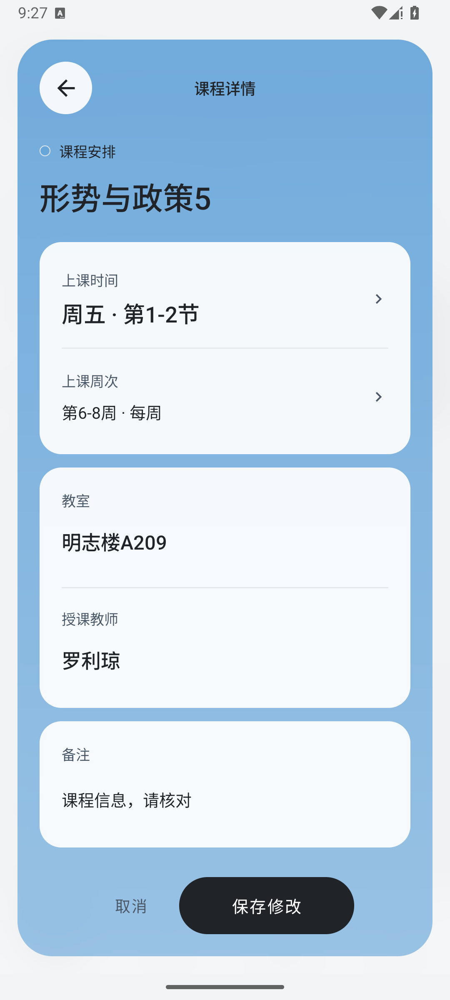
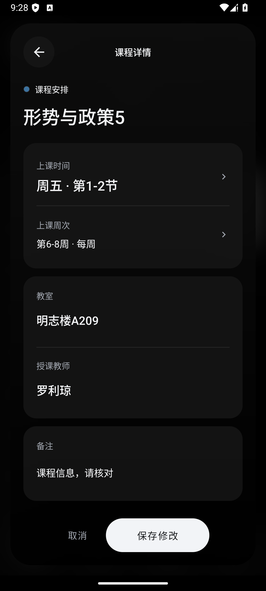
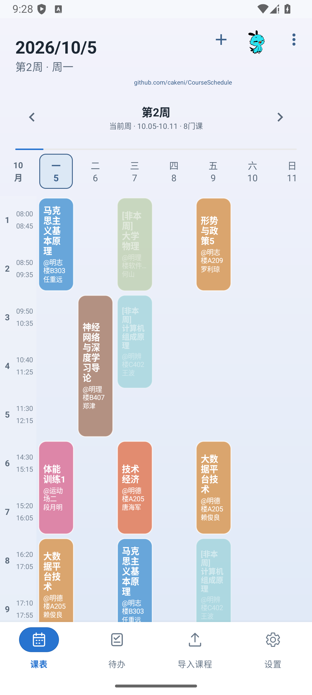
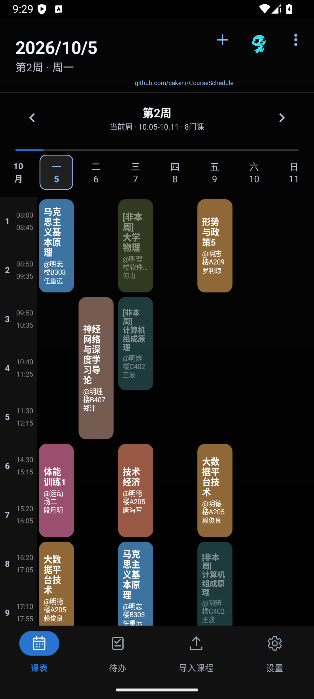

# 课程详情与课表视觉调整

课程详情可以直接修改课程名称、时间、周次、教室、教师和备注，颜色、提醒及删除仍在同一个页面处理。展开与收回从课程块原位置衔接，键盘弹出后保存操作保持可见，草稿可以随页面重建恢复。

白天使用课程同色系柔和渐变和轻背景模糊，夜间保留中性黑色基底。信息卡去掉描边，主要操作使用日间深色、夜间浅色胶囊。文字及输入控件保持清晰，不添加多色光晕或反光纹理。

课程块恢复之前的浅彩和深色配色，“非本周”恢复整个课程块与文字一起降低不透明度，并保留原有文本换行和布局。课程颜色索引及已有数据不变。同步还包含此前已验证的页面导航、待办和导入界面调整，以及 #31 的助手修复，以保持代码与 1.0.55 安装包一致。

以上均为合成课程的 Android 原生运行截图。发布副本完成 23 项设备检查，覆盖材质、换色、编辑/恢复/保存/删除、键盘、源卡首帧、密集课表展开返回、软件模糊、待办完成、页面导航及本地提醒。

单元测试 254 项通过、1 项跳过；Lint 无错误、256 项警告；Debug APK 与设备测试 APK 均构建成功。保留 main 已合并的 AndroidX test.ext:junit 1.3.0 及 CI 更新。版本 1.0.55（versionCode 56），校验数据见 [validation.json](validation.json)。
