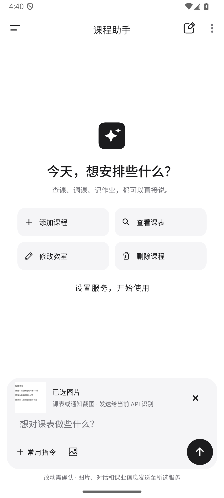
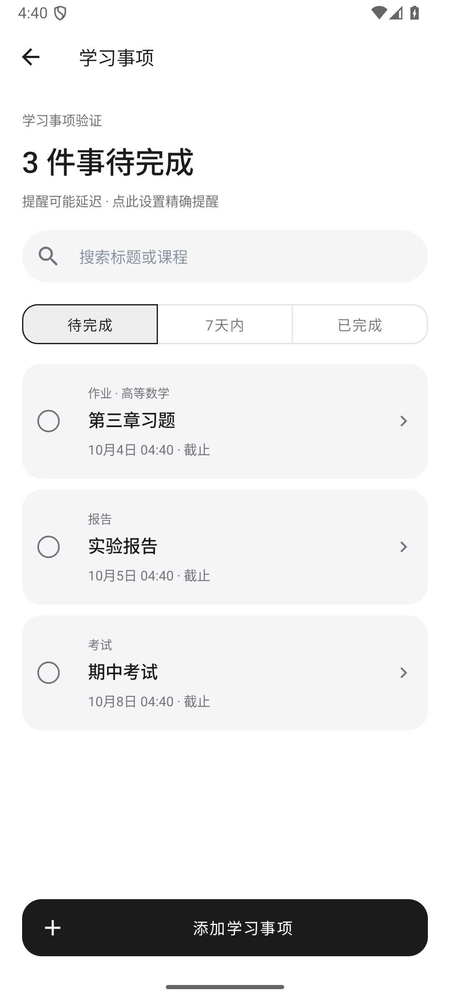
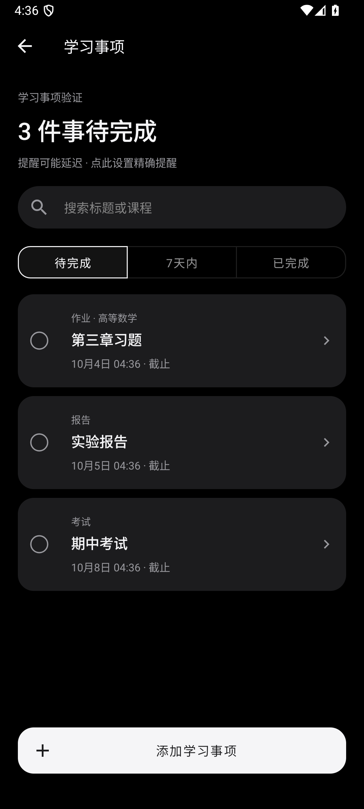

# 图片输入与学习事项

版本：1.0.22（23），2026-10-03。

## 图片输入

课程助手输入框新增图片按钮，可选择课表、调课通知或作业通知截图，配合文字发送。默认使用 `deepseek-flash` 直接识图，采用图片消息接口；已有 API 配置保留，使用其他模型时需要该模型支持图片输入。接口说明见 [DeepSeek 视觉指南](https://api-docs.deepseek.com/guides/vision/)。

识别结果先显示课程或学习事项的待确认方案，确认后才写入。图片中的周次、日期或时间不完整时，会要求补充。截图内的指令作为图片内容处理，不代替用户授权。发送补充修正前，旧方案的确认按钮会禁用，避免按旧内容保存。

已选图片、输入草稿和待确认方案可在应用进程重启后恢复。图片复制到应用私有目录，删除原文件不影响当前对话；删除对话会清理对应图片。每次请求最多附带最近两张不同图片，同一图片不会因重试在上下文中重复发送。一次课程更改最多 20 条，较大的课表需分批处理。

## 学习事项

打开课程助手左侧抽屉，选择“学习事项”。可手动记录作业、考试、报告，关联本学期课程，填写明确的截止日期和时间，设置提醒，并完成、重新打开、编辑或删除事项。页面支持搜索、待办、本周和已完成筛选。手动管理不需要 API。

也可以在对话中创建、查询或修改事项，例如“周五 20 点交物理实验报告，提前一天提醒”。新增、修改和删除均先预览再确认；本周截止、即将考试等查询使用本地已保存事项。缺少截止时间时会追问，同名事项无法确定目标时不会直接修改。

提醒沿用应用现有的总开关、通知权限和通知渠道。完成或删除事项后取消对应提醒，通知可直接打开学习事项。课程改名会同步关联名称，删除课程仍保留已记录的截止事项。

## 数据与兼容性

数据库升级到版本 4，保留已有课程和对话。JSON 备份升级到版本 3，包含学习事项，仍可导入旧备份；导入界面可选择是否导入事项，重复事项不会重复创建。

图片、相关课程和学习事项上下文会发送给当前配置的 API。应用内已有对应提示，密钥未打包到安装包。

## 验证

- 构建、单元测试、Lint 和测试安装包构建通过。单元测试 191 项通过；另有 1 项需显式启用的实时 API 测试，已单独运行通过。
- DeepSeek 真实接口测试 11 组通过，使用合成课表与通知，覆盖课表识别、单次调课、缺失字段、学习事项和图片内指令。
- Android 全量回归 41 项通过；新增功能另在浅色、深色及 360×640 dp 小屏验证。
- 分进程重启验证图片草稿、待确认事项和原课程操作恢复；实际验证提醒送达、恢复后不重复通知及完成后取消提醒。
- Lint 无错误，仍有 180 条警告和 1 条信息。上述样例验证不代表所有复杂截图均可准确识别，保存前需要核对预览。

完整日志与合成样例位于本地 `analysis/assistant-images-study-tasks-20261003/`，安装包及验证摘要位于 `outputs/assistant-images-study-tasks-20261003/`。
