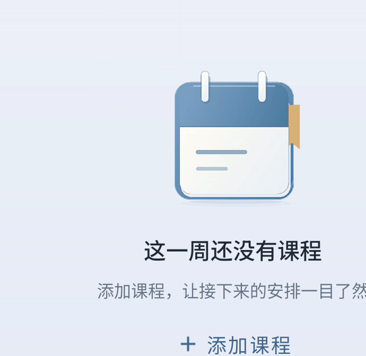

# 空课表单次翻纸动效 · 1.0.40

空周内容原先在切周结束后再次执行整组入场，文字和按钮会重新隐藏后出现。现在让内容随翻页到位，以选中空周为入口执行一段 2.8 秒的完整翻纸动作，完成后保持末帧，停留期间不循环。

纸页抬起、弯曲并翻到封面背后，露出新的一页；封面、书签和阴影分别响应。预加载只准备首帧，覆盖层与正常页面共用同一时间轴，主要动作在插画进入可视区域时开始。文字和添加按钮保持稳定。离开再进入会重新播放，取消滑动和恢复前台不会重播已经完成的动作。关闭系统动画时直接显示末帧。

默认“轻层滑页”和可选“位置接续”均支持有课到空周、连续空周及反向切换；原有月份和星期栏动效保留。

## 原生运行预览



- [轻层滑页完整录屏](preview-soft-slide.mp4)
- [位置接续完整录屏](preview-continuity.mp4)

预览来自 Android 原生模拟器，课程数据由测试构造。GIF 播放一次，停在末帧。

## 素材与复现

Android 使用 Lottie 6.7.1 读取浅色/深色的原创矢量素材；素材为 60 fps、28 层、168 帧。主题素材通过 Lottie 缓存，切周无需重复解析。

使用 Python 标准库重新生成两份素材：

```powershell
python docs/empty-calendar-entrance-20261004/author_calendar.py
```

## 验证

- `:app:testDebugUnitTest :app:assembleDebug :app:assembleDebugAndroidTest :app:lintDebug` 通过；210 项单元测试通过，1 项既有外部模型测试跳过，Lint 0 错误。
- 控制逻辑及空周/日期栏回归的 18 项原生检查通过。随后仅细化纸张曲线，交付版本另通过 5 项检查：两种方案的运行录屏，以及浅色、深色、关闭系统动画下的单次播放检查。
- 单次播放检查覆盖页面到位时已有进度、停留 7.9 秒不重播、再次进入从头播放、取消滑动、前后台切换，以及标题/按钮像素稳定。
- 交付 APK 内的两份素材与源文件逐字节一致。详细结果与 SHA-256 见 [validation.json](validation.json)。
