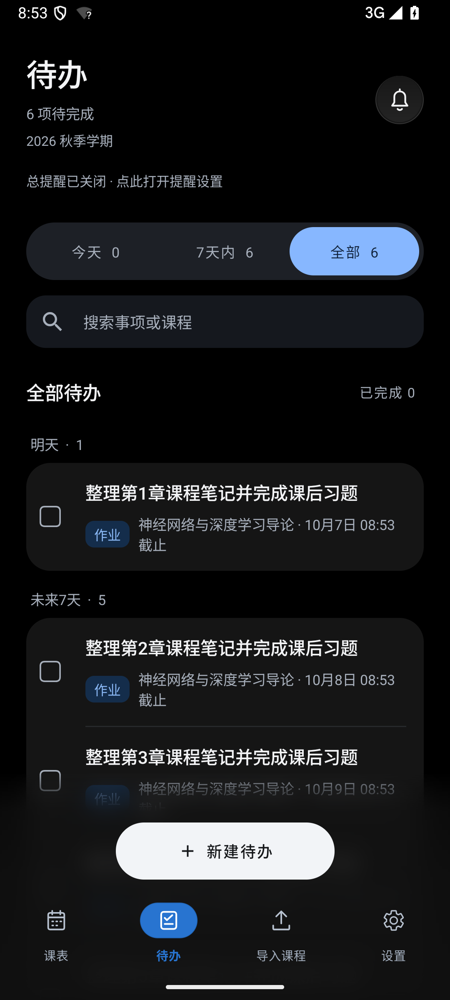
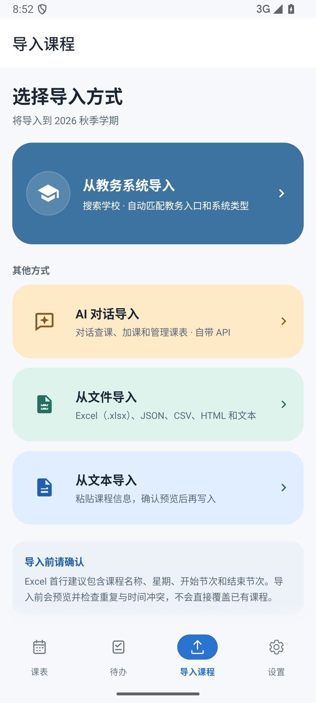
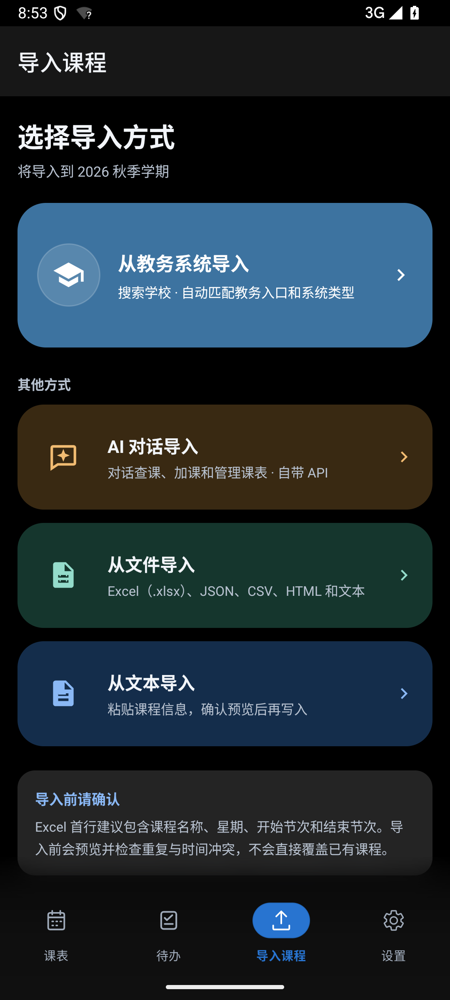
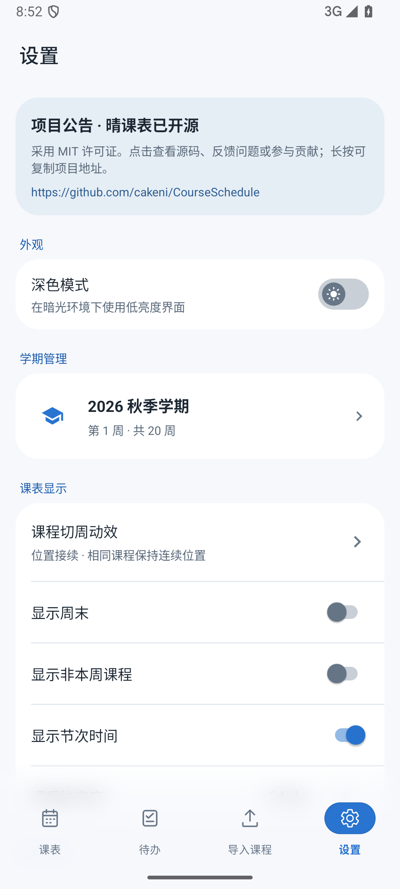
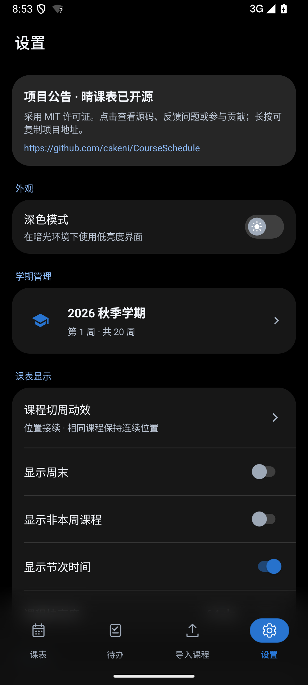

# 四页导航渐变磨砂与交互优化（1.0.65）

课表、待办、导入课程、设置的底部导航统一使用实时模糊与渐变遮罩。列表和课程内容可以延伸到导航下方；导航图标、文字保持清晰。日间采用浅色磨砂，夜间采用深色磨砂，覆盖系统手势区域，减少页面与底栏之间的硬边。

待办的新建按钮与底栏共用磨砂背景，搜索弹出键盘时两者移动到键盘上方。四页保留相同的导航位置，列表末项可以完整滚动到固定操作上方，兼容大字体和三键导航。

本版还接续 1.0.55 之后已完成的界面调整：课程详情恢复大标题与彩色图标信息行，保留直接编辑入口及柔和课程色渐变；收回详情时及时释放触控，背景延伸到手势区域。待办、导入课程和设置使用各自的入场节奏，导入次要方式延后展开；设置日夜切换保留滚动位置，避免重播入场动画。课程块保留已确认的日夜配色与非本周透明度。

## 原生截图

以下截图来自 Android 15 模拟器，待办使用合成数据。

| 页面 | 日间 | 夜间 |
| --- | --- | --- |
| 待办 |  |  |
| 导入课程 |  |  |
| 设置 |  |  |

## 验证

- 独立发布副本：Lint 无错误，271 项警告；单元测试 254 项通过、1 项跳过；应用和设备测试 APK 构建成功。
- 28 项设备检查通过，覆盖日夜模式、手势和三键导航、大字体、四页位置一致性、入场动效、设置主题切换、实时模糊和键盘避让。
- 逐文件核对 393 个源文件，生产源码与本地已验证版本一致；发布 APK 由同步副本构建，并重新完成设备检查。保留远程已合并的测试依赖及 CI 配置。
- 发布 APK SHA-256：`cc310e51072aa7f98a93e170dca0a185356dd28044189b0d5c51315033cd3e94`。

完整校验信息见 [validation.json](validation.json)。
