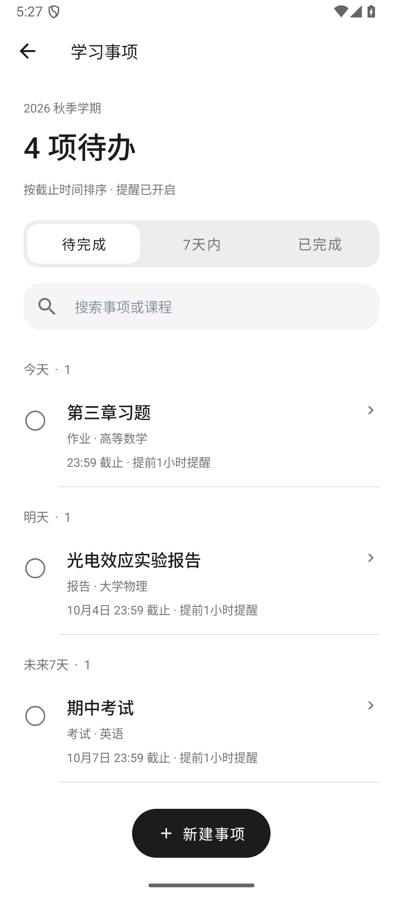
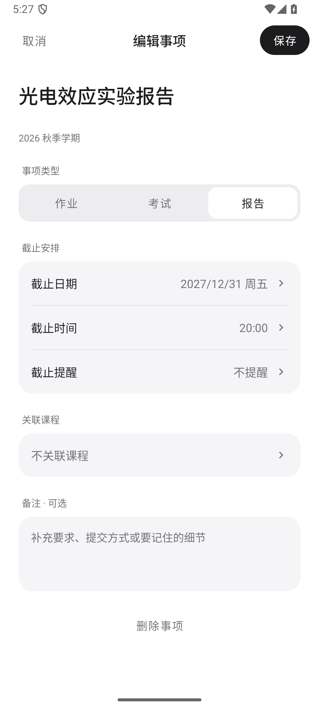
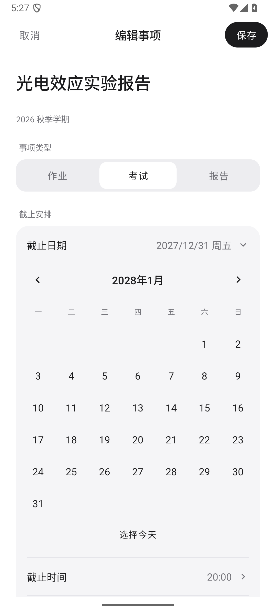
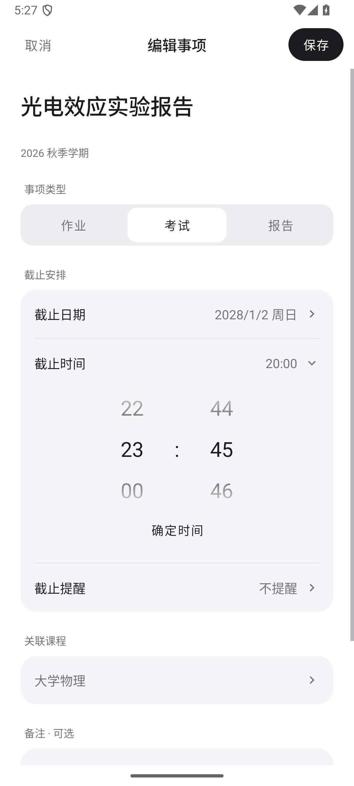
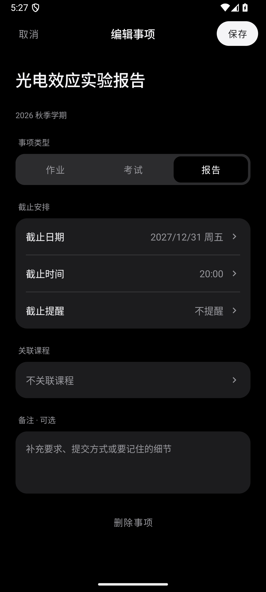

# 学习事项界面重设计

版本：1.0.23（24）。范围为学习事项列表、新建和编辑页面。

列表按已逾期、今天、明天、未来 7 天和稍后分组，标题、课程、截止时间使用不同的字号与字重。完成按钮直接放在事项左侧；待完成、7 天内、已完成采用分段切换。新增入口改为底部紧凑按钮。

新建和编辑使用独立页面，取消与保存固定在顶部。标题直接填写；作业、考试、报告直接点选；截止安排合并为一个设置组，标签与当前值左右排列。日期在页面内展开日历，时间在页面内展开 24 小时滚动选择。课程选择支持搜索，提醒采用页面内的选项列表。所有选择流程无需叠加窗口。

未选择明确日期和时间时不能保存。跨年的截止日期显示年份；旋转后保留填写内容与展开位置。放弃修改和删除使用页面内确认，继续编辑保留原内容。保存时保留已有的学期、关联课程、完成状态和并发修改检查。

沿用助手的黑白灰配色，并适配浅色、深色与小屏。提醒、备份、对话识图和其他页面的配色保持原有行为。

安装包、真实界面截图与验证摘要保存在本地 `outputs/study-ui-redesign-20261003/`，构建及操作验证日志位于 `analysis/study-ui-redesign-20261003/`。

构建、单元测试与 Lint 通过。单元测试 191 项通过、0 失败，另有 1 项需主动启用的实时 API 测试未在本次界面修改中运行。Android 浅色 10 项、深色 4 项、小屏与 1.3 倍字体 4 项通过，覆盖实际保存、跨年选择、旋转恢复、取消、删除、并发修改保护、完成及提醒。Lint 无错误，仍有 206 条警告和 1 条信息。

## 实际界面

