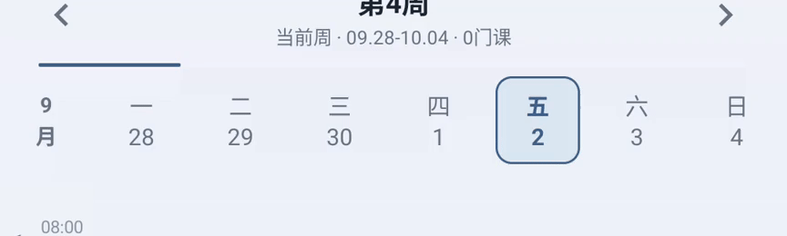
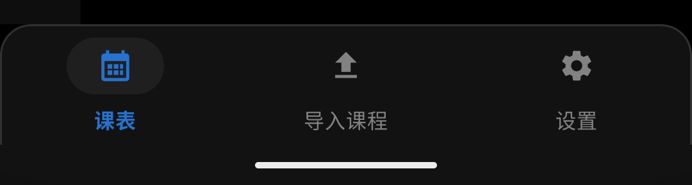

# 星期栏动画与底部横线

星期栏切周结束后，整条栏再次从横向偏移位置淡入，造成生硬的回拉。现在月份、星期和日期逐列轻抬并淡入，沿切周方向错峰展开，最长 338ms 收稳。动画使用单向缓动，星期栏容器保持固定，文字不缩放；课程卡片原有的轻微层次运动继续保留。

导航背景的下描边移出视图边界，Android 9 及以上的系统导航分隔线设为透明，Android 10 及以上关闭系统自动添加的导航区对比分隔，去掉三个导航图标下方的横线。上方圆角轮廓保留。

## 验证

已在 API 35 模拟器完成浅色 4 项、深色 2 项检查，覆盖左右滑动、箭头切周、逐列动画可见性、错峰方向、单向收稳、最终位置和透明度，以及日期数字过渡和页面显示。底部横线通过截图与像素检查确认已移除。测试使用默认学期与空课表。

本次从最新主分支移入后执行 `testDebugUnitTest lintDebug assembleDebug assembleDebugAndroidTest`，176 项单元测试通过，Lint 0 errors、155 项现有 warnings，Debug 与 AndroidTest 构建成功。回归检查位于 `app/src/androidTest/java/com/courseschedule/ui/WeekPagerMotionTest.kt`。

## 实际效果

