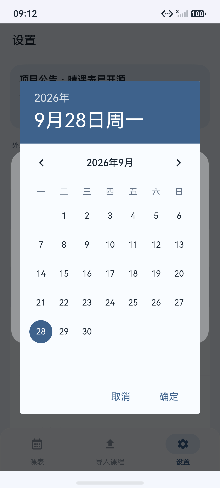
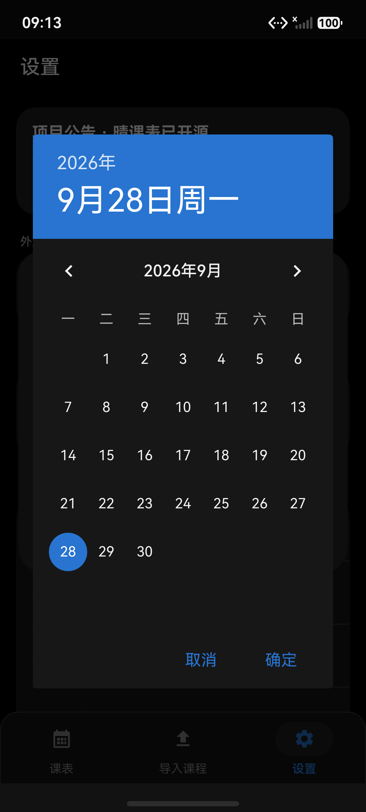

# 鸿蒙原生月历日期选择

学期设置的开学日期改为 ArkUI 月历弹窗，按参考图显示蓝色年份/日期栏、周一到周日的月历、月份切换箭头、圆形选中日期和取消/确定按钮。浅色与深色均沿用应用现有颜色。

日期先在弹窗内暂存，取消、系统返回键或点击遮罩都不修改学期表单；确定后继续回填所选日期所在周的周一。日期按本地自然日构造，避免 `YYYY-MM-DD` 被当成 UTC 日期产生偏移。最后仍需点击“保存学期”才会写入数据。

## 验证

- DevEco Studio 26 / HarmonyOS SDK 26 `assembleHap` 构建通过。
- `node tests/FullPort.cjs`、`node tests/AiRecognition.cjs` 及 4 项排课规则测试通过。
- 新增检查覆盖月历周一开头、28/29/30/31 天、跨年及香港/洛杉矶/基里蒂马蒂时区。
- HarmonyOS 7 / API 26 模拟器验证 8 类操作：月历网格、取消不改日期、切换月份、确认回填周一、闰日与年份切换、深色显示、系统返回、遮罩关闭。
- 验证使用临时新学期表单，没有保存测试学期，深色开关恢复到测试前状态。

运行界面检查前，启动应用并打开设置页，确保学期管理卡片位于屏幕内；脚本会新建临时表单、校验后取消。

```powershell
python docs/calendar-picker-20261001/check_calendar_ui.py
```

界面检查复用已有设备脚本，连接 `127.0.0.1:5555`；记录写入 `entry/build/validation/calendar-picker-20261001/`。

## 效果

| 浅色 | 深色 |
| --- | --- |
|  |  |

产物为鸿蒙原生 HAP。当前工程未配置签名，生成的 `entry-default-unsigned.hap` 已在允许未签名安装的鸿蒙模拟器验证；真机安装需要配置签名。
