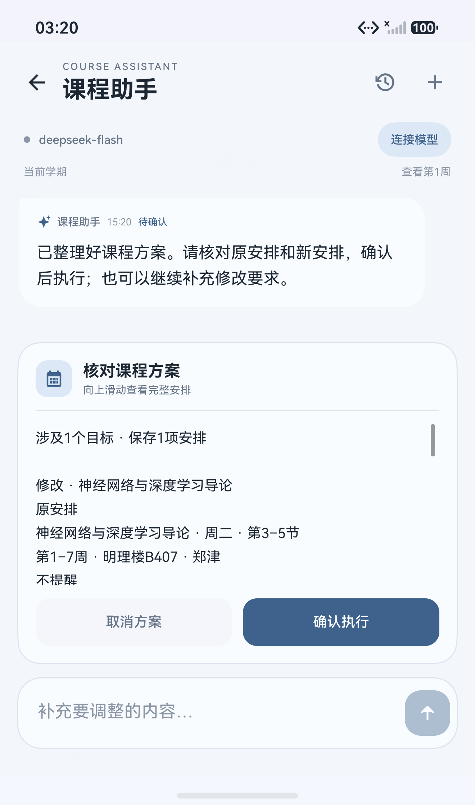
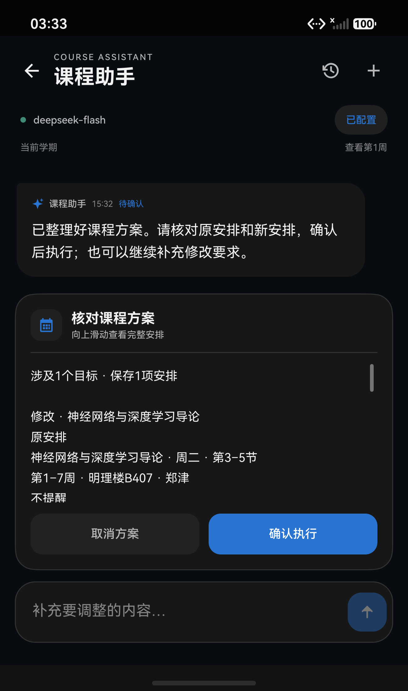
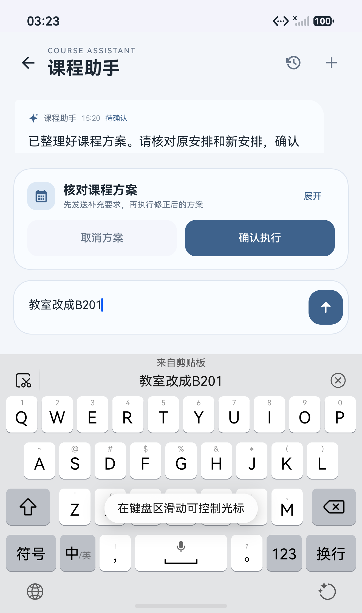
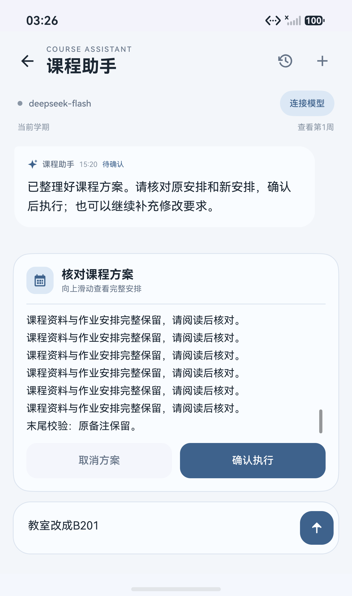
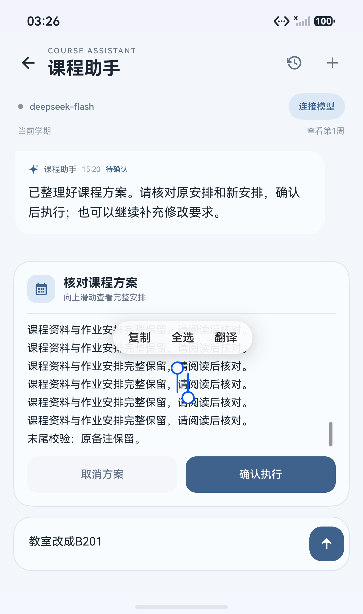
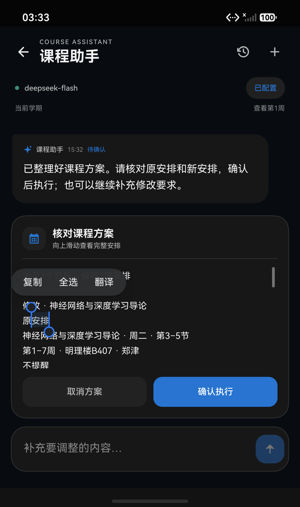
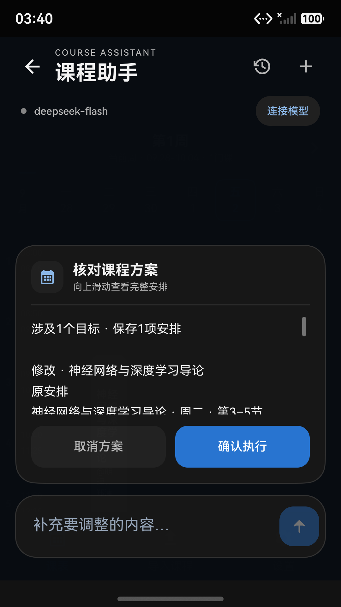
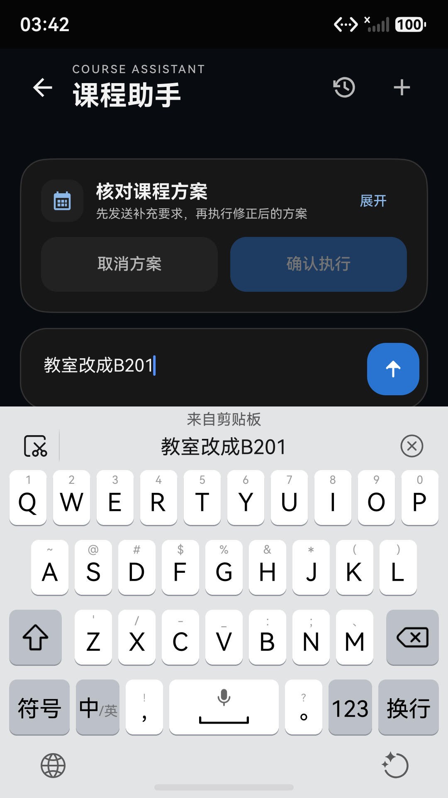

# 课程助手 · 鸿蒙版 0.2.0

课表页右上角和导入页均可进入课程助手。默认 DeepSeek 地址和 `deepseek-flash` 模型；快捷查询在本地完成，其余请求走鸿蒙 NetworkKit。配置与网页识别独立，Key 可明确选择复用或单独填写，勾选后存入 AssetStore，不进入 Preferences 的明文元数据或课表备份。

已同步课程查询、添加、部分字段修改、整条删除、单次取消/调课、备注补充、提醒设置、方案修正、确认/取消、撤销、历史对话、草稿、停止和显式重试。修改/删除及批量新增先预览；单条明确新增可直接执行并撤销。课表和本机回执保存到同一个 Preferences 值，flush 失败时还原缓存，避免显示未保存的成功结果。

## 界面与交互

- 简洁标题、模型状态与学期信息，示例入口帮助开始对话；消息使用较轻的色块和明确的时间层次。
- 方案预览独立于会话列表，支持原生滚动和选择文字，取消/确认按钮固定；长备注完整显示在本机预览，普通候选上下文不上传原备注。
- 键盘出现时收起预览详情，保留输入区与方案入口；存在未发送的补充要求时暂停确认，发送并重新核对后执行。
- 浅色与深色选区底色不同，保留系统选择手柄、复制、全选及翻译菜单。
- 历史和配置表单可滚动，配置保存按钮固定；每次显示最近 60 条消息，可加载更早消息。

<p>
  
  
  
</p>

<p>
  
  
  
</p>

## 验证

- 新增 55 项 Node 检查通过：严格模型协议、实际日期和夏令时、保留未授权字段、单双周拆分、已有冲突与新冲突、撤销有效性、完整本地查询、上下文预算、原备注保护、停止后的迟到回复、失败重试、会话恢复、保存失败、草稿并发及配置保存失败时阻止跨服务地址使用新 Key。
- 原有 `FullPort.cjs`、`AiRecognition.cjs` 与 4 项 `ScheduleCore.test.ts` 检查通过，覆盖多学期、各类文件导入、教务解析、提醒计算和网页识别凭证。
- HarmonyOS 7.0.0 / API 26 模拟器运行 11 项原生检查通过：实际 Preferences 读写、无 Key 本地查询、确认前不写入、待确认恢复、字段保留、同步回执、重启不重放、撤销、单次调课、备份排除会话、实际 AssetStore 保存/清除。
- 真实 DeepSeek 最终 12/12 语义样例通过，见 [评测结果](deepseek-evaluation.md)。初轮 10/12，见 [初轮记录](deepseek-initial.md)：修正方案时模型模仿本机内部格式，被严格校验拒绝；另一个失败当时未保留细分诊断。明确只读快照与输出协议后重新运行完整场景通过，未关闭校验或放宽字段规则。
- 鸿蒙原生 NetworkKit 实际请求成功：为未执行的调课方案补充 B201 教室，保留周四第5–7节、原周次及长备注；确认后课表页显示新安排，撤销恢复原安排。离开页面后重新进入，AssetStore 中的配置可继续使用；第二个真实请求再次生成待确认调课方案。
- 另外使用 1080×1920 / 480 dpi 的独立模拟器检查 360×640vp 深色小屏。收紧标题与方案高度后，键盘、输入及固定按钮均可见；未发送的补充要求使确认按钮暂停可用。
- 小屏中建立新会话、执行本地查询、选择用户消息、打开历史和恢复原会话均已检查；长预览可滑到“末尾校验”标记，草稿与原待确认方案保留。

<p>
  
  
</p>

Debug 与 Release HAP 构建通过，均为未签名包；真机安装需配置签名。交付物通过生产页面列表、测试入口排除和本机凭证排除检查。构建过程中仍有原生组件能力和已弃用 API 等警告，没有宣称全部警告清零。

这些是固定样例和模拟器检查，尚未覆盖所有自然语言输入、全部鸿蒙设备、学校账号登录或真机后台提醒送达。未签名模拟器的代理提醒限制沿用原项目记录；课程保存成功与提醒同步状态分别显示。

## 复现

在 `harmonyos` 目录运行：

```powershell
node --test tests/CourseAssistant.cjs tests/AssistantPlatform.cjs
node tests/FullPort.cjs
node tests/AiRecognition.cjs
node --test tests/ScheduleCore.test.ts
$env:DEVECO_SDK_HOME='D:/devco/DevEco Studio/sdk'
& 'D:/devco/DevEco Studio/tools/node/node.exe' 'D:/devco/DevEco Studio/tools/hvigor/bin/hvigorw.js' assembleHap --mode module -p module=entry -p product=default --no-daemon --no-incremental
```

原生验证使用 `python docs/course-assistant-20261002/native_checks.py prepare` 临时替换入口，构建后安装到独立测试模拟器。检查结束必须执行 `restore` 并重新构建；交付 HAP 只保留 `pages/Index`，不携带测试入口、测试课表或 API Key。

真实模型评测需明确指定本机凭证文件：`node docs/course-assistant-20261002/deepseek_eval.cjs <本机配置路径>`。不要提交凭证文件；脚本只输出场景结论、模型名与用时。`emulator_ui.py` 使用观察到的节点 ID/位置执行操作，密码字段脱敏，临时界面树在读取后删除。
