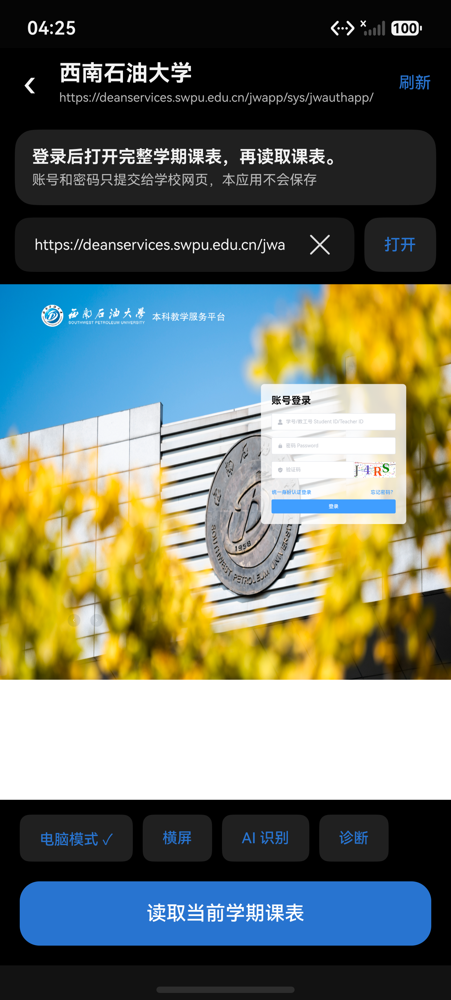

# 教务网页登录页修改地址

在教务网页登录页的登录说明下方、网页上方添加“网址输入框 + 打开”。输入框默认填入所选学校的入口，点清除按钮即可重新填写；点击“打开”直接在当前页加载新网址。安卓与鸿蒙都使用这一布局。

修改地址继续使用所选学校的教务解析器，并将课表读取范围绑定到新地址。地址保留 `#/...` 网页路由，清理临时查询参数，不接受本机路径或含账号的地址。原有 HTTP 地址确认继续生效。

西南石油大学本科入口恢复为此前的教学服务平台登录页：

`https://deanservices.swpu.edu.cn/jwapp/sys/jwauthapp/login/index.html`

历史提交 `9354b68` 将这个入口改成了选课系统。学校[本科学生报到、注册通知](https://www.swpu.edu.cn/dean/info/1051/9301.htm)列出的教学服务平台是 `https://deanservices.swpu.edu.cn/`。内置入口与安卓、鸿蒙目录中的本科条目均已修正。

## 验证

- `node tests/FullPort.cjs` 通过，包含新网址访问范围、解析器保留、网页路由和无效网址检查。
- 最新鸿蒙 `assembleHap` 成功并安装到 HarmonyOS 7 / API 26 模拟器，实际显示西南石油大学的账号登录页。
- 鸿蒙实际验证输入框清除、无效地址提示和点击打开新网址；无效地址不会替换当前网页。
- Android `testDebugUnitTest` 的 133 项测试、`lintDebug` 均通过，APK 构建成功。
- 安卓新增登录页界面测试，通过实际 AndroidJUnitRunner 运行：无效地址保持原入口，修改网址后入口与解析器均正确，结果为 `OK (1 test)`。
- Gradle `connectedDebugAndroidTest` 的 UTP 执行器发生 `NullPointerException`，因此使用同一个测试 APK 和 AndroidJUnitRunner 直接执行上述界面测试。

本次构建和界面测试日志保存在本地 `entry/build/validation/school-address-20261001/`。验证没有输入学校账号或密码。

