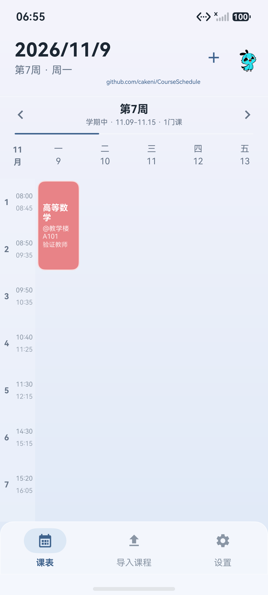
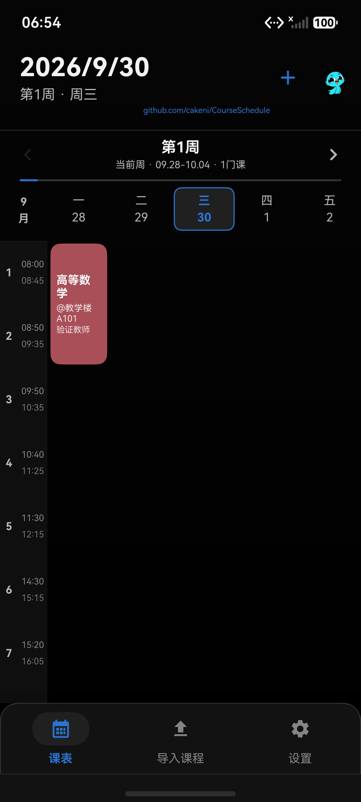
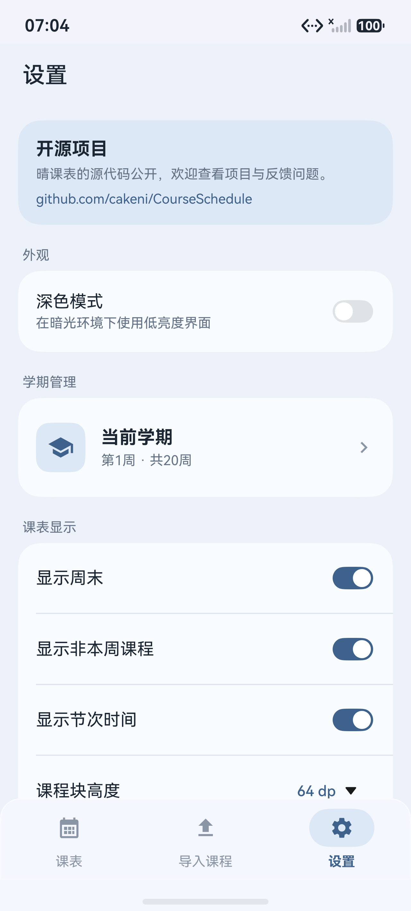
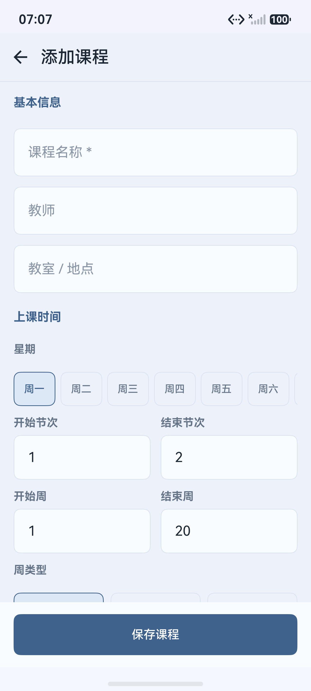
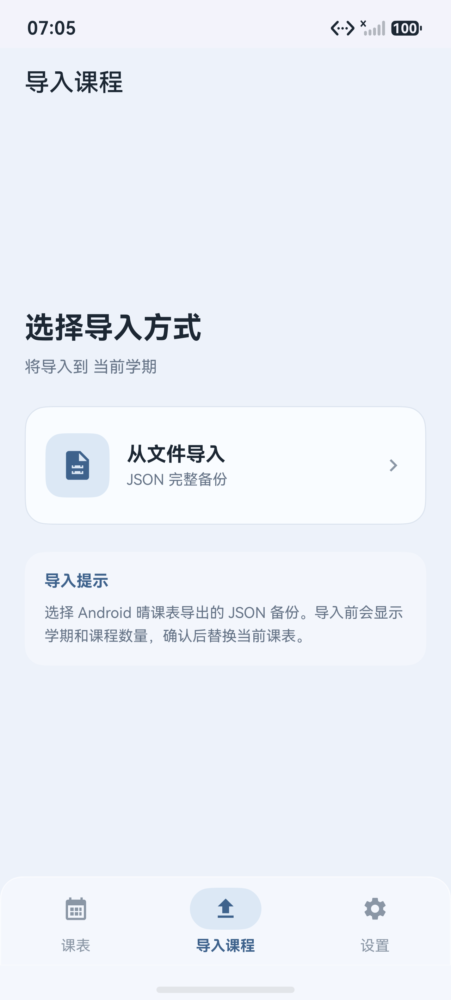
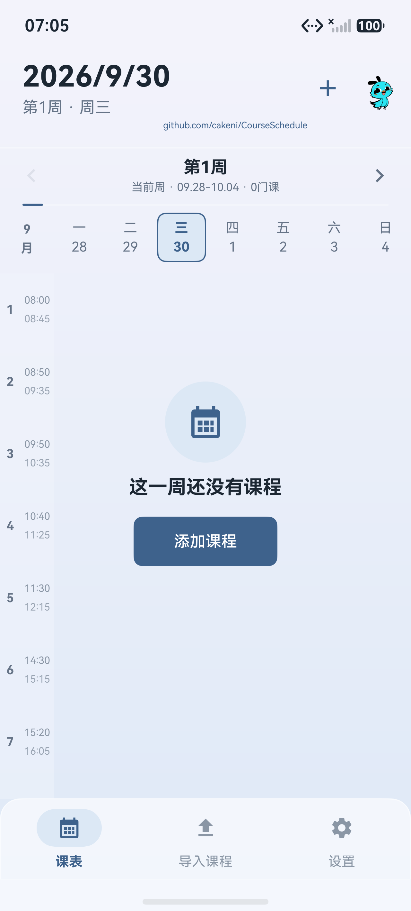

# HarmonyOS 界面对齐记录

基线为仓库中 Android 1.0.13 的布局、控件尺寸、主题颜色及 `docs/screenshots/2026-09-refresh/` 截图。

## 已调整

- 日期标题、周次摘要、加号及原资源吉祥物、周次切换和细进度条。
- 固定星期表头、48 vp 时间栏，5 / 7 天按剩余宽度均分，课程区域只纵向滚动。
- 原来的 16 色课程卡片、白色课程文字、地点与教师、圆角及浅色边框。
- 三项底部导航、设置分组卡片、课程表单分组、星期 / 单双周按钮、完整颜色选择。
- 深色主题、系统栏文字颜色和底部安全区域背景。

## 验证

DevEco Studio 26.0.0.851 / HarmonyOS SDK 26；本地手机模拟器 HarmonyOS 7.0.0，1280 × 2832。

- 完整 `assembleHap` 构建成功，4 项规则测试通过。
- 通过设备 UI 添加临时课程，重启后确认名称、地点和教师正常显示。
- 通过课程详情编辑名称并保存，再次重启确认修改保存。
- 浅色 / 深色切换，显示周末开关，5 / 7 列布局。
- 左右滑动切周、进度条拖动、回到当前周和周次选择列表打开。
- 删除确认可取消；确认后删除课程，再次重启确认课程数量为 0。
- 临时课程已删除，模拟器恢复浅色、显示周末的空课表。

修复了首次载入备份时 ArkUI 列表复用空单元格、导致已保存课程没有显示的问题；单元格标识现在包含课程内容和当周状态。

## 截图

以下课程是验证期间手动输入的临时数据，不是用户课表；模拟器字体和屏幕宽度会影响文字换行。

| 浅色课表 | 深色课表 |
| --- | --- |
|  |  |

## 保留差异

输入控件和课程详情对话框使用 HarmonyOS 原生样式。吉祥物当前为原 Rive 渲染的静态图片，原版动画和拖拽尚未移植。导入页只展示已经实现的 JSON 备份入口；教务导入、其他文件格式及提醒通知仍未实现，系统文件选择器实际导入导出尚未验证。
